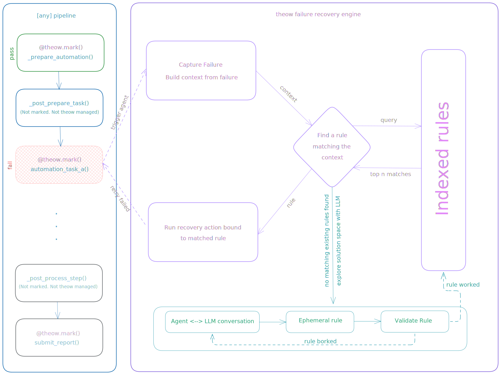

<div align="center">

# theow

*þēow - Old English for "servant" or "bondman."*
</div>

---

Theow is a [rule engine](https://www.geeksforgeeks.org/artificial-intelligence/rule-based-system-in-ai/) designed for auto-failover. It captures failure context automatically, semantically matches it against existing rules, and executes bound actions for recovery. Rules are deterministic. Same context, same fix, every time.

When no rule matches, Theow's internal agent uses an LLM to investigate and write a new rule. This agent is leashed and programmatic by design. It restricts the LLM to a defined set of tools. You specify what the LLM can do, nothing more, providing full but secure automation. As rules accumulate, LLM calls decrease. Since failure modes are finite, they may reach zero over time.



## TL;DR

- **Mark functions** for recovery with `@theow.mark()` - failures trigger the rule engine
- **Rules match context** and execute deterministic fixes
- **No match?** LLM explores, writes a new rule, rule handles it next time
- **You define the tools** the LLM can use - nothing more, nothing less
- **Rules accumulate**, LLM calls decrease, may hit zero over time

## Example

A simplified pipeline with Theow-managed failure recovery:

```python
from theow import Theow

pipeline_agent = Theow(
    theow_dir="./.theow",
    name="pipeline",
    llm="gemini/gemini-2.0-flash",
)

@pipeline_agent.mark(
    context_from=lambda task, exc: {
        "stage": "process",
        "task_id": task.id,
        "error": str(exc),
    },
    explorable=True,
)
def process(task):
    # do work that might fail
    ...

def run_pipeline(task):
    prepare(task)
    process(task)      # failures here trigger theow
    post_process(task)
    complete(task)
```

When `process()` fails, Theow captures the context, matches it against rules, and attempts recovery. If no rule exists and exploration is enabled, the LLM investigates and writes one. This pattern extrapolates to any pipeline with a sequential flow.

## Components

### Initialization

```python
from theow import Theow

pipeline_agent = Theow(
    theow_dir="./.theow",                             # rules, actions, vector store
    name="pipeline",                                  # for logging
    llm="gemini/gemini-2.0-flash",                    # primary LLM (provider/model)
    llm_secondary="anthropic/claude-sonnet-4-20250514", # fallback LLM
    session_limit=20,                                 # max explorations per session
    max_tool_calls=30,                                # max tool calls per conversation
    max_tokens=8192,                                  # max output tokens
)
```

Initialization creates the theow directory structure, loads existing rules and actions, and sets up the vector store. The `name` parameter identifies this instance in logs, making it easy to trace which agent handled which failure in a multi-agent setup.

```
.theow/
├── rules/      # Rule YAML files
├── actions/    # Action Python files
├── prompts/    # Prompt templates
└── chroma/     # Vector DB (auto-managed)
```

### Marker

The `@mark` decorator wraps functions for automatic recovery. When the function raises an exception, Theow captures context, matches against rules, and attempts recovery.

```python
@pipeline_agent.mark(
    context_from=lambda task, exc: {       # (args, exception) -> dict
        "stage": "process",
        "error": str(exc),
        "task_id": task.id,
    },
    max_retries=3,                         # max rules to try
    rules=["specific_rule"],               # try these first, by name
    tags=["pipeline"],                     # then try rules with these tags
    fallback=True,                         # fall back to vector search
    explorable=True,                       # allow LLM exploration
    collection="pipeline",                 # chroma collection for indexing
)
def process(task):
    ...
```

Theow adds tracebacks automatically. The `context_from` callable builds the context dict that rules match against. Include whatever information is relevant for diagnosing failures: error messages, identifiers, state. This dict can be extended with any keys your rules need.

### Rules

Rules are YAML files in `.theow/rules/` that define conditions and responses. The `when` block matches against the context dict populated by `context_from` in the [marker](#marker).

```yaml
name: config_missing                          # unique identifier
description: Required config file not found   # used for vector search
tags: [config, setup]                         # for filtering

when:                                         # all facts must match
  - fact: error
    contains: "FileNotFoundError"             # substring match
  - fact: error
    regex: 'config/(?P<filename>\w+\.yaml)'   # regex with named captures
    examples:                                 # improves vector search recall
      - "FileNotFoundError: config/database.yaml not found"

then:                                         # actions to execute
  - action: create_default_config
    params:
      filename: "{filename}"                  # captured from regex
```

Fact operators: `equals` (exact), `contains` (substring), `regex` (with named captures). Multiple actions can be chained in the `then` block and run sequentially.

### Rule Engine

The engine does not brute-force match facts against all available rules. Instead, it uses semantic search to find rules similar to the failure context, then validates facts against those candidates. This keeps matching fast as the rule set grows.

**1. Explicit Filtering**

If the `@mark` decorator specifies `rules=["name"]` or `tags=["tag"]`, the engine filters the rule set to only those rules. Rules specified by name are tried first, then rules matching the tags. Each candidate rule's `when` block is validated against the context. If a rule matches, its actions are executed and the engine stops. This allows you to scope recovery to known, trusted rules for specific failure points.

**2. Semantic Search**

When no explicit match is found, the engine uses vector search via ChromaDB:

1. **Metadata pre-filter**: Facts with `equals` constraints filter candidates to rules where exact-match facts align with the context
2. **Vector similarity**: Rule descriptions and examples are embedded and searched against the error context. This lets the engine apply existing solutions to similar known problems, even if the exact error message differs
3. **Fact validation**: All `when` conditions must match. Similarity alone is not enough to trigger an action. The engine enforces that facts match to avoid running fixes for the wrong problem

**3. Execution**

The engine retrieves up to N candidates (N = `max_retries`) and tries each in order. If an action fails, the next candidate is tried.

### Actions

Actions are Python functions that rules execute. When a rule matches, its `then` block specifies which actions to run. Parameters come from regex captures in the rule or from the context built by `context_from` in the [marker](#marker).

Actions live in `.theow/actions/` and are auto-discovered on startup.

```python
from theow import action

@action("create_default_config")
def create_default_config(filename: str) -> dict:
    """Create a default config file."""
    Path(f"config/{filename}").write_text("# default\n")
    return {"status": "ok", "created": filename}
```

The action name in the decorator must match the action referenced in the rule's `then` block.

### Exploration

When no rule matches and `explorable=True` in the marker, Theow brings in the LLM. The configured LLM receives the failure context (traceback, exception, and everything from `context_from`) and investigates using the registered [tools](#tools).

Exploration requires the `THEOW_EXPLORE` environment variable to be set. This lets you programmatically enable or disable LLM exploration without changing code. Useful for running with exploration in dev/CI but disabling it in production where you only want deterministic rule matching.

```bash
THEOW_EXPLORE=1 python my_script.py
```

**Semantic Rule Search**

The LLM has access to an internal `search_rules` tool to query the vector database for semantically similar rules. This helps in three ways:

1. **Smarter retries**: The LLM can reason about intent and find rules the engine missed because the error message was slightly different but the underlying problem is the same
2. **Informed rule writing**: When writing a new rule, the LLM can look at how similar problems were solved before instead of starting from scratch
3. **Efficient context**: Instead of dumping every rule into the prompt, the LLM searches for what's relevant, keeping context focused

**Ephemeral Rules**

When the LLM writes a fix, the new rule and action go to `.theow/rules/ephemeral/`. These are unproven until they actually fix the failure. Ephemeral rules persist across multiple LLM conversations within the same exploration session, so each subsequent attempt knows what was tried and why it failed.

Once an ephemeral rule successfully fixes the issue, it gets promoted to the main rules folder and indexed into the vector database for future use.

**Incomplete Rules**

If the LLM hits its session budget before finishing, it can tag the rule as `incomplete` with notes about progress. The next exploration session can pick up where the previous one left off using `list_ephemeral_rules` and `read_ephemeral_rule` tools.

**LLM Configuration**

Set the API key for your provider via environment variable. The agent picks the provider based on the `llm` parameter format in [initialization](#initialization).

| Provider | Format | Environment Variable |
|----------|--------|---------------------|
| Gemini | `gemini/gemini-2.0-flash` | `GEMINI_API_KEY` |
| Anthropic | `anthropic/claude-sonnet-4-20250514` | `ANTHROPIC_API_KEY` |
| Copilot | `copilot/gpt-4o` | `GITHUB_TOKEN` |

### Tools

Tools are how you control what the LLM can do during exploration. They define the boundaries of LLM actions, effectively putting the LLM on a leash. The LLM cannot act outside the tools you register.

Theow provides common tools out of the box:

```python
from theow.tools import read_file, write_file, run_command

pipeline_agent.tool()(read_file)
pipeline_agent.tool()(write_file)
pipeline_agent.tool()(run_command)
```

For tighter control, write custom tools with constraints:

```python
@pipeline_agent.tool()
def read_config(path: str) -> str:
    """Read config files only."""
    if not path.endswith((".yaml", ".json")):
        raise ValueError("Only config files allowed")
    return Path(path).read_text()

@pipeline_agent.tool()
def run_safe_command(cmd: str) -> dict:
    """Run whitelisted commands only."""
    allowed = ["ls", "cat", "grep"]
    if not any(cmd.startswith(a) for a in allowed):
        raise ValueError(f"Command not allowed: {cmd}")
    result = subprocess.run(cmd, shell=True, capture_output=True, text=True)
    return {"stdout": result.stdout, "stderr": result.stderr}
```

This is the key to secure automation. You define the blast radius. The LLM operates within those boundaries.

## LLM Based Actions

Rules can invoke the LLM directly on match instead of running a deterministic action. Useful for failures that need dynamic investigation rather than a fixed fix.

```yaml
name: investigate_unknown
description: Unknown failure, use LLM to investigate

when:
  - fact: error_type
    equals: unknown

llm_config:
  prompt_template: file://prompts/investigate.md   # file path or inline string
  tools: [read_file, run_command]                  # tools the LLM can use
  constraints:
    max_tool_calls: 20
```

Unlike exploration, this does not create new rules. The LLM acts directly on the failure each time the rule matches. Requires an API key for the configured provider.

## Known Limitations

These are known and planned to be addressed:

- **Scale**: Rule matching has not been tested at scale with large rule sets
- **Action chaining**: No intelligent forward or backward chaining. Actions run sequentially in the order defined in the rule
- **Multi-agent**: No multi-agent routing yet. Each Theow instance operates independently
- **Local only**: Rules, actions, vector store must be co-located with the process. No remote rule storage or distributed access yet
- **Vector store**: ChromaDB is the only supported vector store
- **Sync only**: No async support. Execution is synchronous
- **LLM dependency**: Exploration quality depends heavily on the LLM's reasoning ability. Stronger models produce better rules
