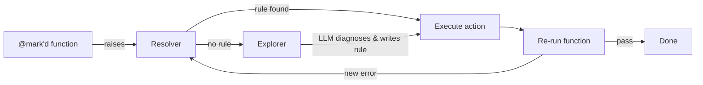

<div align="center">

# theow

*þēow - Old English for "servant" or "bondman."*

[](https://pypi.org/project/theow/)
[](https://pypi.org/project/theow/)
[](LICENSE)
[](https://ai.pydantic.dev/)

</div>

---

Theow is a programmatic LLM agent that auto-heals failing Python functions on the fly. Wrap any function with `@theow.mark()`, and when it fails, theow handles the rest. Zero prompt engineering. Zero code changes beyond the decorator.

```python
from theow import Theow
from theow.tools import read_file, write_file, run_command

agent = Theow(llm="anthropic/claude-sonnet-4-20250514")
agent.tool()(read_file)
agent.tool()(write_file)

@agent.mark(
    context_from=lambda task, exc: {"stage": "deploy", "error": str(exc)},
    explorable=True,
)
def deploy(task):
    ...  # when this fails, theow heals it
```

## Why theow

Theow simplifies programmatic LLM agents through three complementing layers.


```mermaid
flowchart LR
    D["@mark'd function"] -->|raises| R["Resolver"]
    R -->|rule found| A["Execute action"]
    R -->|no rule| E["Explorer"]
    E -->|LLM diagnoses & writes rule| A
    A --> V["Re-run function"]
    V -->|pass| Done
    V -->|new error| R
```

### Layer 1: Conversational agent

At its core, theow is a convenience wrapper around [PydanticAI](https://ai.pydantic.dev/) and the [GitHub Copilot SDK](https://github.com/features/copilot). You give it a prompt, a set of [tools](docs/tools.md), and a token/call budget. Theow runs a conversation loop with the LLM, executing tool calls until the task is done or budget runs out.

```python
agent = Theow(llm="anthropic/claude-sonnet-4-20250514")
agent.tool()(read_file)
agent.tool()(run_command)

agent.run("Fix the broken config file in ./config/", tools=agent.get_tools())
```

PydanticAI can do this on its own. Theow wraps it into a simpler API, adds a unified interface across 15+ providers plus the Copilot SDK (which is a different protocol entirely), and manages the conversation loop with [signals, budget tracking, and nudging](docs/architecture.md). You can optionally enable [middleware](docs/middleware.md) for guardrails on LLM input/output and Logfire for OpenTelemetry instrumentation. But the real value of theow comes from the next two layers.

### Layer 2: Explorer

Theow started as a project to self-heal workflow processes. The explorer is the component that makes this work. Feed it an error context and it automatically diagnoses the problem using internal prompts and whatever tools you've registered. No prompt engineering required.

But the explorer doesn't stop at finding a fix. It converts the LLM's solution into a rule-action pair: a [YAML rule](docs/rules-and-actions.md) that pattern-matches the error, bound to a Python action that fixes it. This pair acts as theow's memory. See [how exploration works](docs/exploration.md) for the full flow.

```python
agent = Theow(llm="anthropic/claude-sonnet-4-20250514")
agent.tool()(read_file)
agent.tool()(write_file)

context = {
    "error": "FileNotFoundError: config.yaml not found",
    "stderr": "Traceback ...\nFileNotFoundError: config.yaml not found",
}

rule = agent.explore(context, tools=agent.get_tools())
# rule is a validated Rule object, or None if exploration failed
```

See [`explore()` API reference](docs/configuration.md#theowexplorecontext-tools-collection-tracing---rule--none).

### Layer 3: Resolver

The resolver is what makes theow fast. Before calling the LLM, it checks if a matching rule already exists, first by explicit name/tag filtering, then by semantic search over the rule database. If a rule matches, its action runs immediately. No LLM call, no tokens spent.

```python
agent = Theow(theow_dir=".theow")

context = {
    "error": "FileNotFoundError: config.yaml not found",
    "stderr": "Traceback ...\nFileNotFoundError: config.yaml not found",
}

rule = agent.resolve(context)
if rule:
    agent.execute_rule(rule, context)
```

See [`resolve()` API reference](docs/configuration.md#theowresolvecontext---rule--none) and [`execute_rule()` API reference](docs/configuration.md#theowexecute_rulerule-context-escalation_context---bool).

The resolver can optionally invoke the explorer when no rule matches, creating a closed loop: **fail -> resolve -> (miss) -> explore -> create rule -> resolve next time**. First failure: the LLM investigates and writes a rule. Second failure of the same kind: the rule fires instantly. As rules accumulate, LLM calls decrease. Since failure modes are finite, they may reach zero.

Rules can also define LLM actions. Instead of running Python code, the matched rule triggers a conversation with a pre-stored prompt from your prompt library. This gives you deterministic routing with dynamic execution. For structural awareness during exploration, you can plug in [CodeGraph](docs/codegraph.md), a tree-sitter based code graph that lets the LLM query symbols, call chains, and class hierarchies instead of reading entire files.

### The decorator

The resolver-explorer pair is assembled into `@theow.mark()`, which wraps any Python function for automatic recovery:

```python
@agent.mark(
    context_from=lambda task, exc: {"error": str(exc), "task_id": task.id},
    explorable=True,    # allow LLM exploration on novel errors
    max_retries=3,      # rules to try per error
    max_depth=3,        # chase cascading errors
)
def process(task):
    ...
```

When `process()` raises, the decorator intercepts the exception, calls `context_from` with the original arguments and the exception to build a context dict, automatically enriches it with the full traceback and exception type, then hands it to the resolver. If no rule matches and `explorable=True`, the explorer takes over. If a fix works, the function is retried transparently within the same call stack, so the caller never knows recovery happened.

The decorator also handles [deep recovery](docs/hooks.md#deep-recovery) (when a fix reveals a new error underneath, theow keeps the changes and continues against the new error), [model escalation](docs/configuration.md#model-routing) (cheap model first, strong model as fallback), and [lifecycle hooks](docs/hooks.md) (setup/teardown callbacks around each recovery attempt). For the full set of [configuration options](docs/configuration.md) including provider setup, see the linked docs. Theow also ships with a [CLI](docs/cli.md) for running explorations from the command line.

## Quick start

```bash
pip install theow
```

```python
from theow import Theow
from theow.tools import read_file, write_file, run_command

agent = Theow(
    theow_dir=".theow",
    llm="anthropic/claude-sonnet-4-20250514",
)

agent.tool()(read_file)
agent.tool()(write_file)
agent.tool()(run_command)

@agent.mark(
    context_from=lambda task, exc: {"error": str(exc)},
    explorable=True,
)
def process(task):
    ...
```

Set your provider's API key and enable exploration:

```bash
ANTHROPIC_API_KEY=sk-... THEOW_EXPLORE=1 python my_script.py
```
