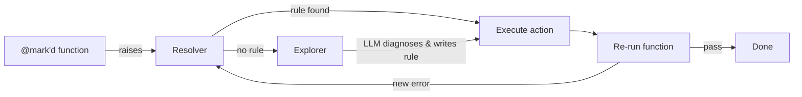

<div align="center">

# theow

*þēow - Old English for "servant" or "bondman."*

[](https://pypi.org/project/theow/)
[](https://pypi.org/project/theow/)
[](LICENSE)
[](https://ai.pydantic.dev/)
[](https://logfire.pydantic.dev/)

</div>

---

What if an agent could live inside your running process? Not a chatbot you prompt, not a linter scanning cold output, but something that's *there* when the exception fires. It sees the state, investigates the failure, fixes it or reports what it found. Leashed, under control, following your rules, but autonomous.

Imagine a CI that heals itself by running an agent inside a live integration test. Or a deployment pipeline that recovers from config drift without human input. Theow is the framework that makes this possible.

---

Theow is an observable, programmatic LLM agent that auto-heals failing Python functions at runtime. Wrap any function with `@theow.mark()`, and when it raises, theow intercepts the exception, diagnoses it, and retries transparently. Every LLM call, tool execution, and token spend is [traced via OpenTelemetry](docs/observability.md). Zero prompt engineering. Zero code changes beyond the decorator.

```python
from theow import Theow
from theow.tools import read_file, write_file, run_command

agent = Theow(llm="anthropic/claude-sonnet-4-20250514")
agent.tool()(read_file)
agent.tool()(write_file)

@agent.mark(
    context_from=lambda task, exc: {"stage": "deploy", "error": str(exc)},
    explorable=True,
)
def deploy(task):
    ...  # when this fails, theow heals it
```

## Why theow

Theow simplifies programmatic LLM agents through three complementing layers.


```mermaid
flowchart LR
    D["@mark'd function"] -->|raises| R["Resolver"]
    R -->|rule found| A["Execute action"]
    R -->|no rule| E["Explorer"]
    E -->|LLM diagnoses & writes rule| A
    A --> V["Re-run function"]
    V -->|pass| Done
    V -->|new error| R
```

### Layer 1: Conversational agent

Theow wraps [PydanticAI](https://ai.pydantic.dev/) and the [GitHub Copilot SDK](https://github.com/features/copilot) into a single interface. Give it a prompt, a set of [tools](docs/tools.md), and a token/call budget. Theow runs a conversation loop with the LLM, executing tool calls until the task is done or budget runs out.

```python
agent = Theow(llm="anthropic/claude-sonnet-4-20250514")
agent.tool()(read_file)
agent.tool()(run_command)

agent.run("Fix the broken config file in ./config/", tools=agent.get_tools())
```

PydanticAI can do this on its own. Theow wraps it into a simpler API, adds a unified interface across the PydanticAI providers (15+) and the Copilot SDK (which is a different protocol entirely), and manages a custom conversation loop with [signals, budget tracking, and nudging](docs/architecture.md). You can optionally enable [middleware](docs/middleware.md) for guardrails on LLM input/output and [Logfire](docs/configuration.md#logfire--opentelemetry) for OpenTelemetry instrumentation. The next two layers are where theow diverges from plain LLM wrappers.

### Layer 2: Explorer

The explorer takes an error context and diagnoses the problem using internal prompts and whatever tools you've registered. No prompt engineering required.

Beyond finding a fix, the explorer converts the LLM's solution into a rule-action pair: a [YAML rule](docs/rules-and-actions.md) that pattern-matches the error, paired with a Python action that fixes it. These pairs persist to disk and get indexed in ChromaDB for retrieval. Remote store support is planned. See [how exploration works](docs/exploration.md) for the full flow.

```python
agent = Theow(llm="anthropic/claude-sonnet-4-20250514")
agent.tool()(read_file)
agent.tool()(write_file)

context = {
    "error": "FileNotFoundError: config.yaml not found",
    "stderr": "Traceback ...\nFileNotFoundError: config.yaml not found",
}

rule = agent.explore(context, tools=agent.get_tools())
# rule is a validated Rule object, or None if exploration failed
```

See [`explore()` API reference](docs/configuration.md#theowexplorecontext-tools-collection-tracing---rule--none).

### Layer 3: Resolver

The resolver checks if a matching rule already exists before calling the LLM. It tries explicit name/tag filtering first, then semantic search over the rule database. If a rule matches, its action runs immediately. No LLM call, no tokens spent.

```python
agent = Theow(theow_dir=".theow")

context = {
    "error": "FileNotFoundError: config.yaml not found",
    "stderr": "Traceback ...\nFileNotFoundError: config.yaml not found",
}

rule = agent.resolve(context)
if rule:
    agent.execute_rule(rule, context)
```

See [`resolve()` API reference](docs/configuration.md#theowresolvecontext---rule--none) and [`execute_rule()` API reference](docs/configuration.md#theowexecute_rulerule-context-escalation_context---bool).

The resolver can optionally invoke the explorer when no rule matches, creating a closed loop: **fail -> resolve -> (miss) -> explore -> create rule -> resolve next time**. First failure: the LLM investigates and writes a rule. Second failure of the same kind: the rule fires instantly. As rules accumulate, LLM calls decrease. Since failure modes are finite, they may reach zero.

Rules can also define LLM actions. Instead of running Python code, the matched rule triggers a conversation with a pre-stored prompt from your prompt library. This gives you deterministic routing with dynamic execution. For structural awareness during exploration, you can plug in [CodeGraph](docs/codegraph.md), a tree-sitter based code graph that lets the LLM query symbols, call chains, and class hierarchies instead of reading entire files.

### The decorator

The resolver-explorer pair is assembled into `@theow.mark()`, which wraps any Python function for automatic recovery:

```python
@agent.mark(
    context_from=lambda task, exc: {"error": str(exc), "task_id": task.id},
    explorable=True,    # allow LLM exploration on novel errors
    max_retries=3,      # rules to try per error
    max_depth=3,        # chase cascading errors
)
def process(task):
    ...
```

When `process()` raises, the decorator intercepts the exception, calls `context_from` with the original arguments and the exception to build a context dict, automatically enriches it with the full traceback and exception type, then hands it to the resolver. If no rule matches and `explorable=True`, the explorer takes over. If a fix works, the function is retried transparently within the same call stack, so the caller never knows recovery happened.

The decorator also handles [deep recovery](docs/hooks.md#deep-recovery) (when a fix reveals a new error underneath, theow keeps the changes and continues against the new error), [model escalation](docs/configuration.md#model-routing) (cheap model first, strong model as fallback), and [lifecycle hooks](docs/hooks.md) (setup/teardown callbacks around each recovery attempt). For the full set of [configuration options](docs/configuration.md) including provider setup, see the linked docs. Theow also ships with a [CLI](docs/cli.md) for running explorations from the command line.

## Quick start

```bash
pip install theow
```

```python
from theow import Theow
from theow.tools import read_file, write_file, run_command

agent = Theow(
    theow_dir=".theow",
    llm="anthropic/claude-sonnet-4-20250514",
)

agent.tool()(read_file)
agent.tool()(write_file)
agent.tool()(run_command)

@agent.mark(
    context_from=lambda task, exc: {"error": str(exc)},
    explorable=True,
)
def process(task):
    ...
```

Set your provider's API key and enable exploration:

```bash
ANTHROPIC_API_KEY=sk-... THEOW_EXPLORE=1 python my_script.py
```

## Sounds good, does it work?

[Parrot](https://github.com/charmarr/parrot) is a CI auto-healing agent built on theow. It wraps `tox` in a GitHub Actions pipeline. Each test stage (lint, static, unit, integration) is a function wrapped with `@theow.mark()`.

When a test fails, parrot intercepts the failure right there in the CI process. The agent has the full error output, the codebase on disk, and tools to read files, write fixes, and re-run commands. It investigates the failure, applies a fix, and retries. For integration tests, it can inspect the live Juju model, query workload logs, and debug a running environment, not a static snapshot of what went wrong.

If the fix works, parrot opens a PR with the changes. If it can't fix it, it comments on the original PR with what it found.

**Example:** [PR #51](https://github.com/charmarr/charmarr/pull/51) introduced a typo in a config path (`/confgi/config.xml`). Parrot caught it in two stages: the linter flagged the spelling errors, and the unit tests failed because the path didn't resolve. Parrot fixed both independently and opened [PR #52](https://github.com/charmarr/charmarr/pull/52) (lint fix) and [PR #53](https://github.com/charmarr/charmarr/pull/53) (unit test fix), then commented on the original PR with links to both.

CI logs from the unit test run:

```
# tox runs, test fails
FAILED tests/unit/test_actions.py::test_rotate_api_key_action
assert 'newkey__123456789012345678901234' in '<?xml version="1.0" ...
  <ApiKey>testkey123456789012345678901234</ApiKey> ...'

# parrot intercepts the failure, matches a rule, starts the LLM
[info] Failure captured                 [Parrot:recovery]
[info] Attempting recovery              [Parrot:recovery] rule=unit_llm
[info] Starting LLM action              [Parrot:explorer] session=1/10
[info] Code graph built                 [Parrot:codegraph] edges=2906 files=101 nodes=846

# agent fixes the typo, parrot re-runs tox — 26/26 pass
tests/unit/test_actions.py::test_rotate_api_key_action PASSED
...
============================== 26 passed in 8.75s ==============================

# teardown creates the fix PR
[info] Fix PR created                   [Parrot:lifecycle] url=https://github.com/charmarr/charmarr/pull/53
Healed by parrot. PR: https://github.com/charmarr/charmarr/pull/53
```

[Full trace on Logfire](https://logfire-eu.pydantic.dev/ivdi/charmarr?q=trace_id%3D%27019cd558ccd57d17b8d175f70da21773%27+and+span_id%3D%2720ede65e763d7b36%27&spanId=20ede65e763d7b36&traceId=019cd558ccd57d17b8d175f70da21773&env=-clear-&since=2026-03-10T00%3A55%3A55.112283Z&until=2026-03-10T01%3A55%3A55.112283Z) (requires a Logfire account).
