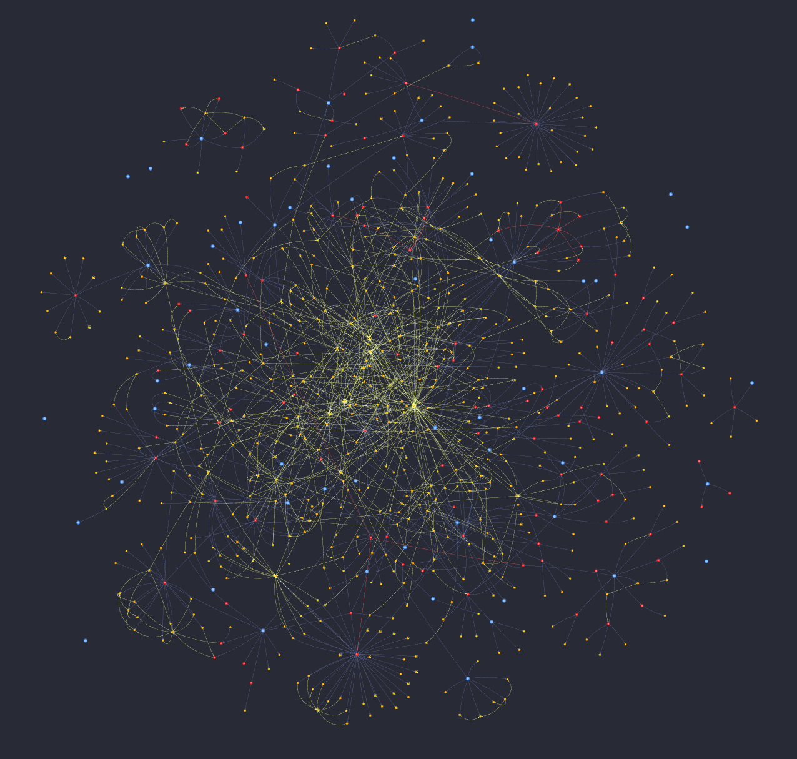

# CodeGraph

Tree-sitter based code structure graph for theow's LLM explorer. Instead of reading entire files to orient (~4000+ tokens), the explorer queries the graph for symbols, call chains, imports, and class hierarchies (~260 tokens).

<div align="center">

<br>
<sub>Theow's own code graph, generated with <a href="../assets/codegraph/visualize.py">assets/codegraph/visualize.py</a></sub>
</div>

## Install

CodeGraph is an optional dependency:

```bash
pip install theow[codegraph]
```

## Usage

```python
from theow import Theow
from theow.codegraph import CodeGraph

graph = CodeGraph(root="./src")

engine = Theow(theow_dir=".theow", llm="anthropic/claude-sonnet-4-20250514")
engine.tool()(graph.search_code)
```

The graph builds automatically on first `search_code` call. The LLM gets a single tool that covers all navigation needs.

## `search_code` API

| Parameter | Description |
|-----------|-------------|
| `query` | Symbol name or substring to search for |
| `kind` | Filter by type: `"function"`, `"class"`, `"module"` |
| `scope` | What to search (see below) |
| `file` | Filter to a specific file |
| `line` | Find the symbol at this line number in file |
| `target` | Target symbol for `"path"` scope |

### Scopes

| Scope | Description | Example |
|-------|-------------|---------|
| `symbol` | Find symbols by name (default) | `search_code(query="Rule", kind="class")` |
| `callers` | Who calls this symbol? | `search_code(query="matches", scope="callers")` |
| `callees` | What does this symbol call? | `search_code(query="build", scope="callees")` |
| `references` | All incoming/outgoing relationships | `search_code(query="LLMGateway", scope="references")` |
| `definition` | Where is this symbol defined? | `search_code(scope="definition", file="models.py", line=42)` |
| `file` | List all symbols in a file | `search_code(scope="file", file="_core/_models.py")` |
| `path` | Find relationship path between two symbols | `search_code(query="module.py", scope="path", target="Rule")` |

## Language support

Visitors extract structure from source files using tree-sitter. Currently supported:

- **Python**: functions, classes, methods, imports, calls, decorators, docstrings
- **Go**: functions, methods with receivers, structs, interfaces, imports, calls, struct embedding

Languages are configured explicitly:

```python
graph = CodeGraph(root="./src", languages=["python", "go"])
```

Defaults to `["python"]` if not specified.

## Configuration

```python
graph = CodeGraph(
    root="./src",
    languages=["python", "go"],       # languages to parse
    excludes={"vendor", "testdata"},   # directories to skip
    max_file_size=1_000_000,           # skip files larger than this (bytes)
)
```

Default excludes: `__pycache__`, `.git`, `.tox`, `.venv`, `venv`, `node_modules`, `dist`, `build`, `.mypy_cache`, `.ruff_cache`, `.pytest_cache`.

## Serialization

```python
# Save to JSON
graph.to_json("graph.json")

# Load from cache
graph = CodeGraph.from_json("graph.json")

# Get JSON string
json_str = graph.to_json()
```

## How it works

1. **Parse**: Tree-sitter visitors walk source files and extract `Node` (symbols) and `Edge` (relationships) objects
2. **Index**: Nodes are indexed by file path and short name for fast lookup
3. **Resolve**: Symbolic call targets (short names like `helper`) are resolved to fully qualified node IDs, preferring same-file matches
4. **Query**: `search_code` navigates the graph using adjacency lists and BFS, no external graph library needed
