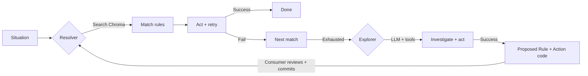
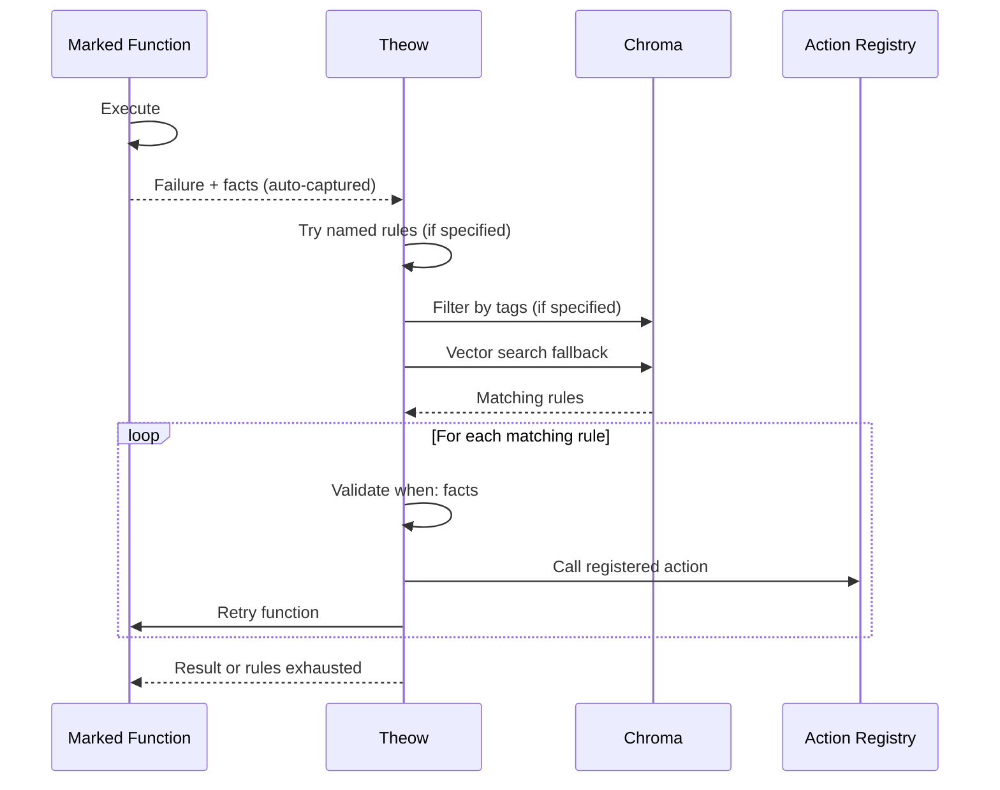
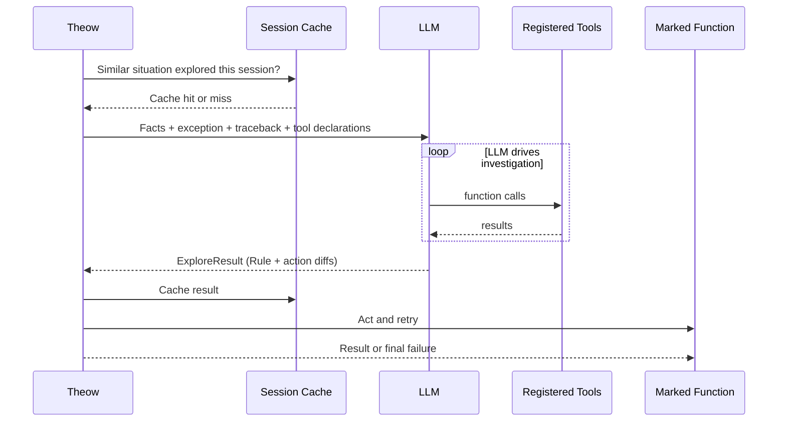
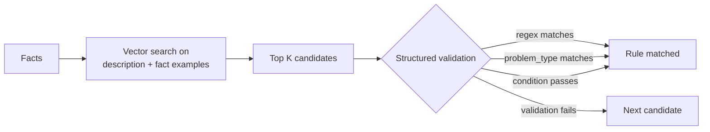
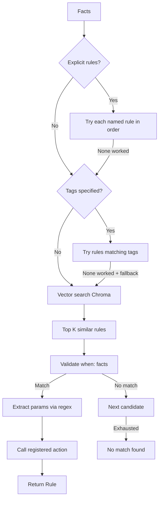
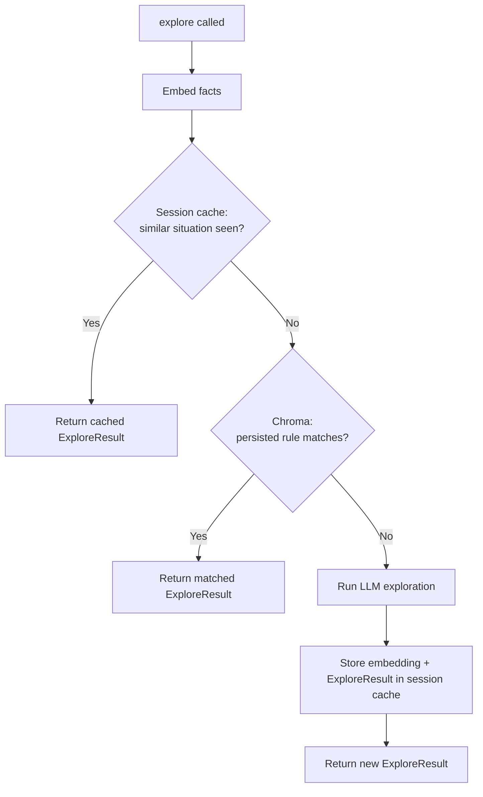
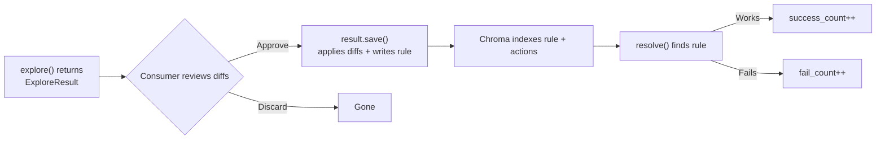

# Theow — Framework Specification

> **Theow** (Old English: þeow, "bound servant")
>
> Also rhymes with meow. 🐱

---

## 1. What Theow Is

Theow is a **Python library** that implements a rule-based expert system with LLM-powered knowledge acquisition. It provides:

- **Rule-based resolution** that matches facts against known rules (deterministic, fast, free)
- **Semantic similarity matching** that finds similar past situations via vector search (cheap)
- **LLM-powered exploration** that uses tool calling to investigate and handle novel situations (expensive, last resort)
- **A learning loop** where explored outcomes are captured as deterministic rules for future use

### Core Principle

**The LLM's job is to make itself less needed over time.** Resolver hit rate goes up, Explorer calls go down, cost per run drops.

---

## 2. Architecture Overview



Two modes of operation:

- **Resolution mode** where `@theow.mark()` or `theow.resolve()` matches rules and acts on them. No LLM. Fast, free.
- **Exploration mode** where `@theow.mark(explorable=True)` with `THEOW_EXPLORE=1` or `theow.explore()` uses LLM to investigate novel situations. Produces a rule AND the action code to execute it. Expensive, last resort.

---

## 3. API Surface

```python
from theow import Theow, Rule, Fact, Action, LLMConfig
```

| Element | Kind | What it is |
|---|---|---|
| `Theow` | Engine | Holds Chroma, config, registries |
| `@theow.tool()` | Decorator | Register a callable for LLM to use |
| `@theow.action()` | Decorator | Register a callable for rules to reference |
| `@theow.mark()` | Decorator | Resolve, explore, retry |
| `theow.resolve()` | Method | Match rules. Returns `Rule` |
| `theow.explore()` | Method | LLM investigation. Returns `ExploreResult` |
| `theow.meow()` | Method | Stats 🐱 |
| `Rule` | Data | when (Facts) + then (Actions) + metadata |
| `Fact` | Data | A condition in `when:` |
| `Action` | Data | A step in `then:` |
| `ExploreResult` | Data | Rule + list of ProposedAction diffs |
| `ProposedAction` | Data | Unified diff for a new or modified action |

### 3.1 The Engine

```python
from theow import Theow

theow = Theow(
    theow_dir="./.theow",
    llm="gemini/gemini-2.0-flash",
    llm_secondary="anthropic/claude-sonnet-4-20250514",  # optional
    session_limit=20,                                     # optional, max LLM explores per session
)
```

`llm` is the primary model, used by default. Format is `provider/model`. API key resolved from environment (`GEMINI_API_KEY`, `ANTHROPIC_API_KEY`, `OPENAI_API_KEY`, etc.).

`llm_secondary` is an optional fallback. Kicks in when primary fails or when a rule explicitly requests a more capable model via `use_secondary: true`.

### 3.2 Tool Registration

Tools are callables that the LLM invokes during exploration. Theow inspects type hints and docstrings to auto-generate LLM function declarations. Any callable works.

```python
@theow.tool()
def read_file(path: str) -> str:
    """Read a file from the workspace."""
    return Path(path).read_text()

@theow.tool()
def run_command(cmd: str, cwd: str) -> dict:
    """Run a shell command and return output."""
    result = subprocess.run(cmd, shell=True, cwd=cwd, capture_output=True)
    return {"returncode": result.returncode, "stderr": result.stderr.decode()}
```

Theow ships base tool classes (`BaseFileReader`, `BaseCommandRunner`, `BaseTempDir`) that consumers can extend or use directly.

### 3.3 Action Registration

Actions are pure functions that rules reference by name. Called by the Resolver during resolution. Actions can live anywhere in the consumer's codebase or in `.theow/actions/` for LLM-generated ones. Both merge into one registry.

```python
# In consumer's codebase, wherever it makes sense
@theow.action("patch_spread_go_version")
def patch_spread_go_version(workspace: str, go_version: str):
    """Patch spread task.yaml to install correct Go version."""
    subprocess.run(["sed", "-i", f"s/go-version:.*/go-version: {go_version}/", "task.yaml"], cwd=workspace)
```

```python
# In .theow/actions/fix_module_rename.py (LLM-generated, human-reviewed)
from theow import action
import subprocess

@action("fix_module_rename")
def fix_module_rename(workspace: str, old_path: str, new_path: str) -> dict:
    """Resolve module rename by finding compatible version."""
    result = subprocess.run(
        ["go", "list", "-m", "-versions", new_path],
        cwd=workspace, capture_output=True
    )
    versions = result.stdout.decode().split()
    latest = versions[-1]
    
    subprocess.run(
        ["go", "mod", "edit", "-replace", f"{old_path}={new_path}@{latest}"],
        cwd=workspace
    )
    subprocess.run(["go", "mod", "tidy", "-e"], cwd=workspace)
    
    return {"status": "ok", "version": latest}
```

Theow auto-discovers actions in `.theow/actions/*.py` on startup and registers them alongside any `@theow.action()` decorated functions in the consumer's code.

Actions should be pure functions: inputs in, subprocess calls or file operations, result out. No classes, no state. This makes them easy to review, test, and throw away.

Actions are indexed in Chroma alongside rules. The Explorer searches available actions before proposing new ones (see §6 The Explorer).

**Tools vs Actions:**

- **Tools** are called by the LLM during exploration (read_file, run_command, kubectl_logs)
- **Actions** are called by the rule engine during resolution (fix_module_rename, patch_go_version)

### 3.4 Mark

The decorator. Marks a function as Theow-managed. Handles resolution, exploration, and retry.

```python
@theow.mark(
    problem_type="build_failure",
    facts_from=lambda x: {
        "stderr": x.stderr,
        "config": read_config(x),
    },
    max_retries=5,
    rules=["known_fix_1", "known_fix_2"],
    tags=["go", "dep_resolution"],
    fallback=True,
    explorable=False,
)
def my_build_step(x):
    return run_build(x)
```

**Parameters:**

| Param | Purpose |
|---|---|
| `problem_type` | Categorizes the situation for Chroma search |
| `facts_from` | Lambda that extracts facts from the function's args |
| `max_retries` | How many different rules to try before giving up |
| `rules` | Optional. Try these named rules first, in order |
| `tags` | Optional. Try rules with matching tags next |
| `fallback` | If explicit rules and tags fail, fall back to vector search |
| `explorable` | If True and `THEOW_EXPLORE=1` is set in environment, explore via LLM when all rules are exhausted. Default False |

**Resolution path** (always active):



**Exploration path** (only when `explorable=True` and `THEOW_EXPLORE=1`):



When `explorable=True`, the decorator auto-captures the exception, traceback, and facts from the failed function call.

However, `explorable=True` alone does not activate exploration. The environment variable `THEOW_EXPLORE=1` must also be set. Both gates must be open:

- `explorable=True` on the decorator (code-level intent, safe to leave in production)
- `THEOW_EXPLORE=1` in the environment (runtime activation)

```bash
# Normal pipeline run: resolve only, no LLM, even with explorable=True in code
just onboard go --single-pkg="github.com/some/pkg"

# Exploration run: both gates open
THEOW_EXPLORE=1 just onboard go --single-pkg="github.com/some/pkg" --from=9 --until=9
```

`session_limit` acts as a third safety net, capping total LLM calls per session.

When `explorable=False` (default), Theow only tries rules. No LLM calls regardless of environment. Safe for production pipelines.

### 3.5 Resolve (Direct Call)

Match rules without the decorator. Returns a `Rule` with resolved params. Consumer handles everything.

```python
rule = theow.resolve(
    problem_type="build_failure",
    facts={"stderr": stderr, "config": config_contents},
)

if rule:
    rule.name               # "module_path_rename"
    rule.then[0]            # Action with resolved params, no placeholders
    rule.act()              # calls the registered actions
    rule.to_yaml()          # serialize for storage
```

### 3.6 Explore (Direct Call)

LLM investigation without the decorator. For batch exploration of historical situations, cross-system debugging, or interactive use. Takes an explicit list of tools (unlike `@theow.mark()` which uses all registered tools). Returns an `ExploreResult`.

```python
result = theow.explore(
    facts={
        "problem": "build fails with error X",
        "stderr": stderr_output,
    },
    tools=[read_file, write_file, run_command, dep_resolve, run_pipeline],
)

if result:
    # Review what the LLM proposed
    print(result.rule.to_yaml())
    for action in result.actions:
        print(action.preview())     # shows unified diffs
    
    # Apply diffs and write rule
    result.save()
```

The consumer can register any combination of tools. The LLM receives all of them as function declarations and drives the investigation. Theow orchestrates the tool-calling loop.

The resolution happens during exploration (the LLM calls tools to handle the situation live). The `ExploreResult` captures the knowledge for future use: a rule for matching and action diffs for the code.

Use `theow.explore()` when there is no function to decorate: batch processing historical situations from a database, investigating cross-system issues like Kubernetes pod crashes, or interactive debugging in a REPL.

### 3.7 meow() 🐱

Stats. Pulls counts from Chroma metadata.

```python
theow.meow()
# 🐱 142 resolves, 12 explores
# 🐱 top rules:
#    module_path_rename      89s / 2f
#    go_version_mismatch     34s / 0f
#    false_leaf_detection    12s / 1f
# 🐱 struggling:
#    flaky_dep_resolution     3s / 11f
# 🐱 total cost: $47.23
```

### 3.8 Logging

Standard Python logging under the `theow` logger name.

```python
import logging
logging.getLogger("theow").setLevel(logging.DEBUG)
```

```
theow: searching 5 candidates...
theow: trying "module_path_rename"... no match
theow: trying "false_leaf_detection"... match!
theow: resolved "false_leaf_detection" on attempt 2
theow: no match found for "dep_expansion"
```

---

## 4. Rule Structure

Rules are the core knowledge artifact. They follow standard production rule nomenclature: `when` (facts/conditions) and `then` (actions/consequent). They accumulate, get versioned, and humans can review them.

### Data Model

```python
@dataclass
class Rule:
    # Identity
    name: str
    description: str        # human-readable, embedded in Chroma

    # Production rule: when facts match, then act
    when: list[Fact]
    then: list[Action]

    # Classification
    tags: list[str] = field(default_factory=list)

    # Probabilistic path (optional)
    llm_config: LLMConfig | None = None

    @property
    def type(self) -> Literal["deterministic", "probabilistic"]:
        return "probabilistic" if self.llm_config else "deterministic"

    def act(self) -> Any:
        """Execute the rule. Calls registered actions with resolved params."""
        ...

    def to_yaml(self, path: str | None = None) -> str:
        """Serialize rule to YAML. Optionally write to path."""
        ...

    @classmethod
    def from_yaml(cls, path: str) -> "Rule":
        """Load rule from a YAML file."""
        ...

@dataclass
class Fact:
    fact: str                           # what to check (e.g. "stderr", "problem_type")
    equals: str | None = None
    contains: str | None = None
    regex: str | None = None
    condition: Callable | None = None
    examples: list[str] = field(default_factory=list)  # optional, vector search fuel
    # Multiple facts in when: are ANDed. All must match.

@dataclass
class Action:
    action: str         # name of a registered @theow.action() callable
    params: dict        # can reference {extract.N} for regex captures
    # Actions in then: execute sequentially, top to bottom.

@dataclass
class LLMConfig:
    prompt_template: str        # inline prompt or file:// path
    tools: list[str]
    constraints: dict
    use_secondary: bool = False

@dataclass
class ProposedAction:
    name: str               # "fix_module_rename"
    description: str        # one-liner for review
    diff: str               # unified diff format
    target_file: str        # path relative to repo root
    
    def apply(self, cwd: str = "."):
        """Apply the diff using patch."""
        subprocess.run(["patch", "-p1"], input=self.diff.encode(), cwd=cwd)
    
    def preview(self) -> str:
        """Print the diff for review."""
        return self.diff

@dataclass
class ExploreResult:
    rule: Rule                        # proposed rule (immutable, written once)
    actions: list[ProposedAction]     # new/modified actions (mutable, as diffs)
    
    def save(self, cwd: str = "."):
        """Write rule YAML and apply all action diffs."""
        self.rule.to_yaml(f"{cwd}/.theow/rules/")
        for action in self.actions:
            action.apply(cwd)
```

`resolve()` returns a `Rule`. `explore()` returns an `ExploreResult`. The Rule is the same dataclass in both cases, but when returned from `resolve()` the params are already resolved with regex captures filled in.

`success_count` and `fail_count` are tracked in Chroma metadata. `theow.meow()` surfaces them.

### Prompt Templates

`prompt_template` can be either an inline string or a file path. For complex prompts, a file keeps the rule YAML clean while the prompt can be as verbose as needed.

```yaml
# Inline
llm_config:
  prompt_template: |
    Fix this build error. Focus on the dependency issue.
  tools: [read_file, run_command]

# File reference
llm_config:
  prompt_template: file://prompts/fix_dep_failures.md
  tools: [read_file, run_command, dep_resolve]
```

### Chroma Embedding Strategy

Each rule is embedded as `description` + all `examples` from its facts, concatenated. The description gives conceptual context ("module URL rename causes build failure") while fact examples give literal context (actual stderr snippets). At match time, the incoming facts are semantically closer to the examples than to the description alone. Combining both improves recall.

Example:

```
Embedded text: "Module had a URL rename. Build fails because the required
path doesn't match the module's declared path. ||| github.com/imdario/mergo@v1.0.2:
parsing go.mod: module declares its path as: dario.cat/mergo but was required
as: github.com/imdario/mergo"
```

2 to 5 examples per fact. Not enough to introduce noise. Enough to improve recall.

### YAML Representation

#### Deterministic Rule

```yaml
name: module_path_rename
description: >
  Module had a URL rename. Build fails because the required
  path doesn't match the module's declared path.
tags: [go, dep_resolution, rename, manual]

when:
  - fact: problem_type
    equals: dep_resolution
  - fact: stderr
    regex: 'declares its path as: (\S+)\s+but was required as: (\S+)'
    examples:
      - |
        github.com/imdario/mergo@v1.0.2: parsing go.mod:
              module declares its path as: dario.cat/mergo
              but was required as: github.com/imdario/mergo
      - |
        github.com/golang/lint@v0.0.0: parsing go.mod:
              module declares its path as: golang.org/x/lint
              but was required as: github.com/golang/lint

then:
  - action: fix_path_rename
    params:
      new_path: "{extract.1}"
      old_path: "{extract.2}"
```

#### Probabilistic Rule

```yaml
name: build_failure_unknown
description: >
  Build fails with an error not covered by deterministic rules.
  Use LLM to investigate and propose a resolution.
tags: [go, build, catchall, manual]

when:
  - fact: problem_type
    equals: build_failure

llm_config:
  prompt_template: file://prompts/investigate_build_failure.md
  tools: [read_file, write_file, run_command]
  constraints:
    max_tool_calls: 15
    max_tokens: 8192
  use_secondary: true
```

### Two-Phase Matching



1. **Vector search** on the combined `description + fact examples` embedding finds semantically similar rules
2. **Structured validation** on `when:` facts confirms the rule actually applies

Rules can rely on a good description (vector search finds them), strict regex (precise matching), or both.

### Chroma Collection

Single collection. The derived `type` property in rule metadata distinguishes deterministic from probabilistic.

### Indexing

Rules are `.rule.yaml` files in the `rules/` directory. Actions are `.py` files in `actions/` and in the consumer's codebase. Theow scans both on startup and syncs with Chroma using content hashes:

```
Startup:
  for each .rule.yaml in rules/
    hash = sha256(file contents)
    chroma_hash = chroma.get_metadata(rule_name).hash

    if no chroma entry → embed and store hash
    if hash != chroma_hash → re-embed and update hash
    if hash == chroma_hash → skip

  for each registered action (auto-discovered + decorated)
    embed action name + docstring + signature
    store in Chroma for Explorer to search
```

At resolve time, Chroma returns rule hits. At explore time, Chroma also returns action hits so the LLM can reuse existing actions.

---

## 5. The Resolver

The deterministic path. Known situations, known actions. No LLM.



---

## 6. The Explorer

The probabilistic path. LLM with tool calling for novel situations.

### Session Cache

When `explore()` is called in a loop, many situations may share the same root cause. Theow deduplicates using a session cache: an in-memory list of `(embedding, ExploreResult)` pairs on the Theow instance.



First time Theow sees "module declares its path as X but was required as Y" it runs the full LLM exploration. The next 49 times it sees similar stderr, it returns the cached result without calling the LLM.

The session cache lives on the Theow instance. When the instance dies, cache is gone. Only rules the consumer explicitly saves to `rules/` persist across sessions.

### Session Limit

`session_limit` (see §3.1) caps LLM explore calls per instance. After the limit, `explore()` returns None.

### Flow

After session cache and Chroma miss (see flowchart above):

1. Builds an LLM tool-calling session with the consumer's tools as function declarations and budget constraints
2. LLM drives the investigation within one API session (no oscillation)
3. LLM produces two outputs: a rule (when does this situation apply) and action diffs (what to do about it)
4. Caches the result, returns an `ExploreResult`

### Explorer Output

The Explorer returns an `ExploreResult` (see §4 Data Models), not a `Rule`. This keeps the Rule clean. The Explorer searches Chroma for existing actions before proposing new ones. It can:

- **Reuse** existing actions by referencing them in the rule
- **Compose** multiple existing actions in sequence
- **Modify** an existing action to handle a new edge case (diff against existing file)
- **Create** a new action when nothing fits (diff against `/dev/null`)

Only new or modified actions appear in `result.actions`. Reused actions are just referenced by name in the rule.

Example output for a new action:

```python
result = theow.explore(facts={...}, tools=[...])

result.rule.to_yaml()
# name: module_path_rename
# when:
#   - fact: stderr
#     regex: 'declares its path as: ...'
# then:
#   - action: fix_module_rename
#     params:
#       old_path: "{extract.2}"
#       new_path: "{extract.1}"

result.actions[0].preview()
# --- /dev/null
# +++ .theow/actions/fix_module_rename.py
# @@ -0,0 +1,18 @@
# +from theow import action
# +import subprocess
# +
# +@action("fix_module_rename")
# +def fix_module_rename(workspace: str, old_path: str, new_path: str) -> dict:
# +    ...

result.save()  # writes rule YAML, applies diffs
```

Example output extending an existing action:

```python
result.actions[0].preview()
# --- .theow/actions/fix_go_mod_replace.py
# +++ .theow/actions/fix_go_mod_replace.py
# @@ -12,6 +12,12 @@
#      latest = versions[-1]
#  
# +    # Handle case where latest is incompatible
# +    result = subprocess.run(
# +        ["go", "mod", "tidy", "-e"],
# +        cwd=workspace, capture_output=True
# +    )
# +    if result.returncode != 0:
# +        latest = versions[-2] if len(versions) > 1 else latest
```

### Tool Execution

Tool functions run in the consumer's process as callbacks. The consumer controls what tools do. Theow orchestrates the LLM to tool loop.

### Budget Controls

- **Max tool calls** per session prevents runaway exploration
- **Max tokens** per session kills the session if exceeded
- **Previous attempt compression** on retry means only the diagnosis carries forward

---

## 7. The Learning Loop

Usage tracking and consumer curation.



### How It Works

1. `explore()` returns an `ExploreResult` with a Rule and a list of ProposedActions (as diffs)
2. Consumer reviews the rule and action diffs (or consumer's exploration script opens a PR)
3. `result.save()` writes the rule YAML and applies the diffs via `patch -p1`
4. Theow indexes the rule and actions into Chroma on next startup
5. `resolve()` finds the rule via vector search when a similar situation comes in
6. The rule references actions by name, Theow calls them
7. Success and fail counts tracked in Chroma metadata, surfaced via `theow.meow()`

### Mutability Boundary

Rules and tools are immutable. Actions are mutable.

- **Rules** are written once by the Explorer or a human. They define when a rule applies (`when:` conditions) and which actions to call (`then:`). The LLM proposes new rules but never modifies existing ones. If a rule needs changing, a human changes it. This prevents silent match regressions (e.g. a broadened regex matching situations it shouldn't).
- **Tools** are registered by the consumer. The LLM calls them during exploration but cannot modify them. They define what the LLM can do.
- **Actions** are mutable. The LLM can create new actions, modify existing ones, or compose them. This is why the Explorer outputs diffs for actions but complete YAML for rules.

### What Theow Does NOT Do

Theow never commits files on its own. It never decides which rules to keep or discard. It never modifies existing rules. It proposes new rules, proposes action diffs, and tracks success/fail counts. The consumer curates.

Consumer runs `theow.meow()`, sees a rule struggling (3s / 11f), and decides: fix the action code, rewrite the rule, remove both, or let the explorer try something different next time.

### Match Ranking

When multiple rules match a situation, Theow ranks them by:

1. Cosine similarity from vector search (semantic relevance)
2. Weighted by success/fail ratio from Chroma metadata (track record)

Higher similarity + higher success rate = higher rank.

---

## 8. LLM Gateway

Theow uses a base `LLMGateway` class with provider-specific implementations. Starting with Gemini. Others added as needed.

```python
class LLMGateway(ABC):
    @abstractmethod
    def tool_session(
        self,
        prompt: str,
        tools: list[Callable],
        budget: dict,
    ) -> ToolSessionResult:
        """Run a tool-use loop. LLM calls tools until done or budget exhausted."""
        ...

    @abstractmethod
    def generate(
        self,
        prompt: str,
        schema: dict | None = None,
    ) -> dict:
        """Single generation, optionally with structured output."""
        ...


class GeminiGateway(LLMGateway):
    """Gemini implementation using google-genai SDK."""
    ...
```

The `provider/model` string in the `Theow` constructor routes to the right gateway:

- `gemini/gemini-2.0-flash` instantiates `GeminiGateway`
- `anthropic/claude-sonnet-4-20250514` would instantiate `AnthropicGateway` (when implemented)
- `ollama/qwen2.5-coder` would instantiate `OllamaGateway` (when implemented)

Two methods. `tool_session` for the Explorer's tool-calling loop. `generate` for when the Resolver needs a single LLM call (e.g. adapting a similar solution).

---

## 9. Technology Stack

| Component | Choice | Rationale |
|---|---|---|
| **Language** | Python | AI ecosystem native, `pip install theow` |
| **Vector DB** | ChromaDB | Free, local, Rust-core (2025), metadata filtering |
| **Embedding** | `all-MiniLM-L6-v2` | Chroma default, free, local |
| **LLM** | Provider-agnostic | `LLMGateway` base class. Gemini implementation first |
| **Validation** | Pydantic | Rule schemas, config, contracts |
| **State** | JSON in `.theow/runs/` | Simple, git-friendly |
| **Logging** | `theow` via Python `logging` | Standard |

---

## 10. The `.theow/` Directory

```
.theow/
├── config.yaml              # Engine config (LLM, budget, thresholds)
├── rules/                   # All rules as .rule.yaml files
├── actions/                 # LLM-generated action functions (.py)
├── prompts/                 # Verbose prompt files referenced by rules
├── chroma/                  # Vector DB (auto-populated from rules/ and actions/)
└── runs/                    # Run history, metrics, learning loop state
```

---

## 11. Outlook

Future evolution beyond the core library:

- **Forward chaining** where `when/then` rules can assert and retract facts, enabling composable rule chains. Small detection rules produce facts, action rules consume them. Eliminates combinatorial explosion when symptoms interact (e.g. Kubernetes: OOM + HPA maxed + memory leak = three small composable rules instead of one monolithic rule per combination). Simple forward chaining loop, no Rete needed at current scale.
- **Daemon** that runs Theow as a persistent server
- **Scout** agents dispatched by the Daemon to discover failure modes in connected systems
- **Periodic resolution** where the Daemon sends Scouts to explore, then uses the Resolver to fix, on a schedule. Apply to Kubernetes clusters, CI pipelines, infrastructure, anything with observable failures
- **Trio** for the Daemon's concurrency model (also rhymes with theow). Structured concurrency, no asyncio. Worth exploring when the Daemon becomes real

The Daemon/Scout architecture builds on the existing Explorer and Resolver.

---

## 12. Open Questions

- **Chroma similarity threshold**: what cosine similarity score cutoff before a rule is considered "not matching"? Needs calibration with real data.
- **Concurrency for Daemon mode**: currently all Theow APIs are synchronous. For the Daemon, each `explore()` and `resolve()` call is independent I/O-bound work. `ThreadPoolExecutor` handles this. For structured concurrency, explore `trio` when the Daemon becomes real. Start synchronous.
