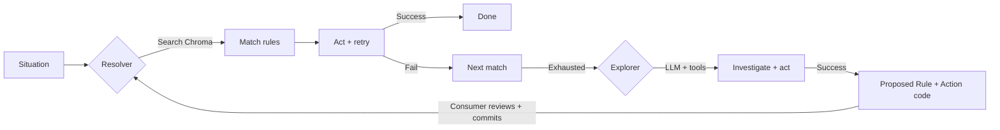
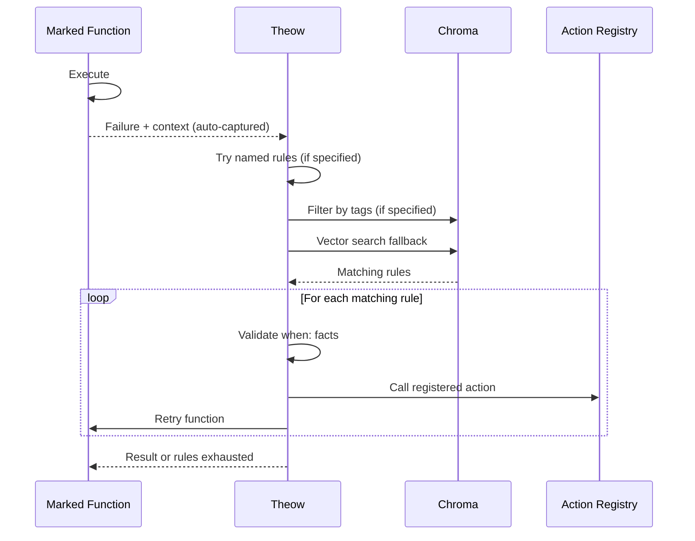
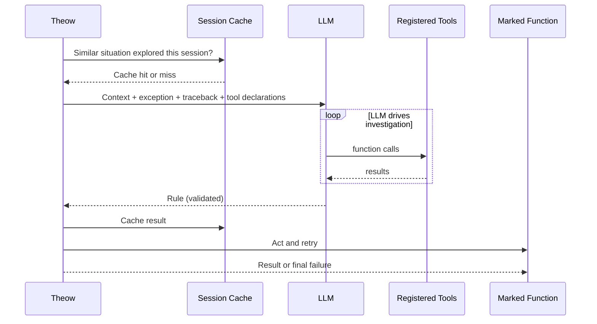
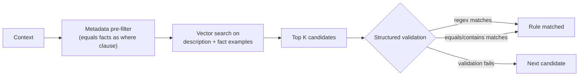
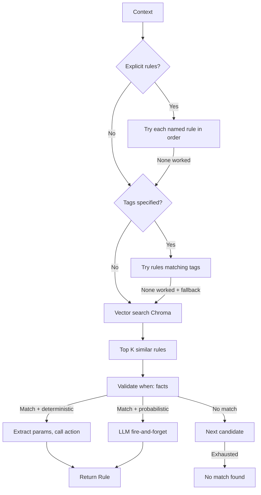
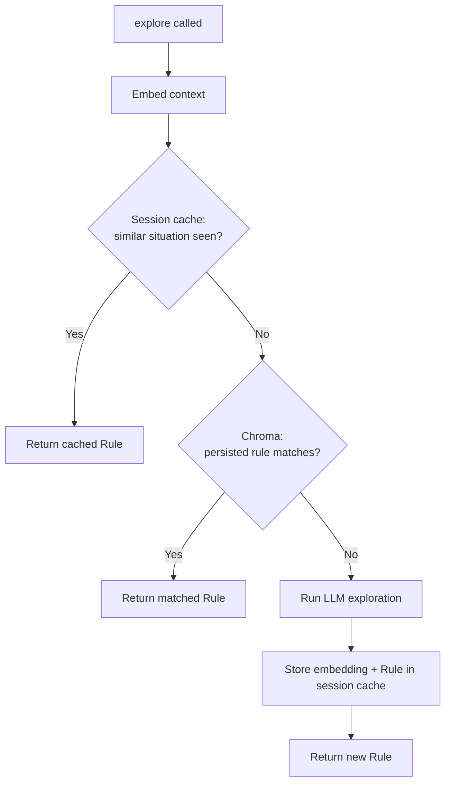
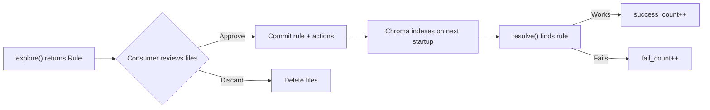

# Theow: Framework Specification

> **Theow** (Old English: þeow, "bound servant")
>
> Also rhymes with meow. 🐱

---

## 1. What Theow Is

Theow is a **Python library** that implements a rule-based expert system with LLM-powered knowledge acquisition. It provides:

- **Rule-based resolution** that matches facts against known rules (deterministic, fast, free)
- **Semantic similarity matching** that finds similar past situations via vector search (cheap)
- **LLM-powered exploration** that uses tool calling to investigate and handle novel situations (expensive, last resort)
- **A learning loop** where explored outcomes are captured as deterministic rules for future use

### Core Principle

**The LLM's job is to make itself less needed over time.** Resolver hit rate goes up, Explorer calls go down, cost per run drops.

---

## 2. Architecture Overview



Two modes of operation:

- **Resolution mode** where `@theow.mark()` or `theow.resolve()` matches rules and acts on them. Deterministic rules call actions directly (no LLM). Probabilistic rules hand off to the LLM (fire-and-forget, no persistence). Fast for known problems.
- **Exploration mode** where `@theow.mark(explorable=True)` with `THEOW_EXPLORE=1` or `theow.explore()` uses LLM to investigate novel situations. Produces new deterministic rules and action code. Expensive, last resort.

---

## 3. API Surface

```python
from theow import Theow, Rule, Fact, Action, LLMConfig
```

| Element | Kind | What it is |
|---|---|---|
| `Theow` | Engine | Holds Chroma, config, registries |
| `@theow.tool()` | Decorator | Register a callable for LLM to use |
| `@theow.action()` | Decorator | Register a callable for rules to reference |
| `@theow.mark()` | Decorator | Resolve, explore, retry |
| `theow.resolve()` | Method | Match rules. Returns `Rule` |
| `theow.explore()` | Method | LLM investigation. Returns `Rule` |
| `theow.meow()` | Method | Stats 🐱 |
| `Rule` | Data | when (Facts) + then (Actions) + metadata |
| `Fact` | Data | A condition in `when:` |
| `Action` | Data | A step in `then:` |

### 3.1 The Engine

```python
from theow import Theow

theow = Theow(
    theow_dir="./.theow",
    llm="gemini/gemini-2.0-flash",
    llm_secondary="anthropic/claude-sonnet-4-20250514",  # optional
    session_limit=20,                                     # optional, max LLM explores per session
)
```

`llm` is the primary model, used by default. Format is `provider/model`. API key resolved from environment (`GEMINI_API_KEY`, `ANTHROPIC_API_KEY`, `OPENAI_API_KEY`, etc.).

`llm_secondary` is an optional fallback. Kicks in when primary fails or when a rule explicitly requests a more capable model via `use_secondary: true`.

### 3.2 Tool Registration

Tools are callables that the LLM invokes during exploration. Theow inspects type hints and docstrings to auto-generate LLM function declarations. Any callable works.

```python
@theow.tool()
def read_file(path: str) -> str:
    """Read a file from the workspace."""
    return Path(path).read_text()

@theow.tool()
def run_command(cmd: str, cwd: str) -> dict:
    """Run a shell command and return output."""
    result = subprocess.run(cmd, shell=True, cwd=cwd, capture_output=True)
    return {"returncode": result.returncode, "stderr": result.stderr.decode()}
```

The decorator is just registration. It puts the callable in a registry for the LLM gateway.

### 3.3 Action Registration

Actions are pure functions that rules reference by name. Called by the Resolver during resolution. Actions can live anywhere in the consumer's codebase or in `.theow/actions/` for LLM-generated ones. Both merge into one registry.

```python
# In consumer's codebase, wherever it makes sense
@theow.action("patch_spread_go_version")
def patch_spread_go_version(workspace: str, go_version: str):
    """Patch spread task.yaml to install correct Go version."""
    subprocess.run(["sed", "-i", f"s/go-version:.*/go-version: {go_version}/", "task.yaml"], cwd=workspace)
```

```python
# In .theow/actions/fix_module_rename.py (LLM-generated, human-reviewed)
from theow import action
import subprocess

@action("fix_module_rename")
def fix_module_rename(workspace: str, old_path: str, new_path: str) -> dict:
    """Resolve module rename by finding compatible version."""
    result = subprocess.run(
        ["go", "list", "-m", "-versions", new_path],
        cwd=workspace, capture_output=True
    )
    versions = result.stdout.decode().split()
    latest = versions[-1]
    
    subprocess.run(
        ["go", "mod", "edit", "-replace", f"{old_path}={new_path}@{latest}"],
        cwd=workspace
    )
    subprocess.run(["go", "mod", "tidy", "-e"], cwd=workspace)
    
    return {"status": "ok", "version": latest}
```

Theow auto-discovers actions in `.theow/actions/*.py` on startup and registers them alongside any `@theow.action()` decorated functions in the consumer's code.

Actions should be pure functions: inputs in, subprocess calls or file operations, result out. No classes, no state. This makes them easy to review, test, and throw away.

Actions are indexed in Chroma alongside rules. The Explorer can search existing actions via built-in tools (`search_actions`, `list_actions`) before proposing new ones (see §6 The Explorer).

**Tools vs Actions:**

- **Tools** are called by the LLM during exploration (read_file, run_command, kubectl_logs)
- **Actions** are called by the rule engine during resolution (fix_module_rename, patch_go_version)

### 3.4 Mark

The decorator. Marks a function as Theow-managed. Handles resolution, exploration, and retry.

```python
@theow.mark(
    context_from=lambda x, exc: {
        "problem_type": "build_failure",
        "stderr": x.stderr,
        "config": read_config(x),
    },
    max_retries=5,
    rules=["known_fix_1", "known_fix_2"],
    tags=["go", "dep_resolution"],
    fallback=True,
    explorable=False,
)
def my_build_step(x):
    return run_build(x)
```

**Parameters:**

| Param | Purpose |
|---|---|
| `context_from` | Callable that builds the context dict. Receives the function's original args/kwargs plus the caught exception as the last argument. Runs after the function fails. |
| `max_retries` | How many different rules to try before giving up |
| `rules` | Optional. Try these named rules first, in order |
| `tags` | Optional. Try rules with matching tags next |
| `fallback` | If explicit rules and tags fail, fall back to vector search |
| `explorable` | If True and `THEOW_EXPLORE=1` is set in environment, explore via LLM when all rules are exhausted. Default False |
| `collection` | Optional. Chroma collection name for this function's rules. Default `"default"`. Use separate collections when problem types have distinct semantic spaces (e.g. `"test_failures"` vs `"dep_resolution"`) |

**Auto-captured tracing:** On exploration, Theow always captures the full traceback (`traceback.format_exc()`), exception type and message, and Python logging output (via a temporary handler on the root logger during execution). These are injected into the LLM prompt alongside the consumer's context. The consumer builds domain context (stderr, config, package name). Theow handles Python-level tracing. Neither duplicates the other.

**Resolution path** (always active):



**Exploration path** (only when `explorable=True` and `THEOW_EXPLORE=1`):



When `explorable=True`, the decorator auto-captures the exception, traceback, and log output from the failed function call. These go to the LLM alongside the consumer's context.

However, `explorable=True` alone does not activate exploration. The environment variable `THEOW_EXPLORE=1` must also be set. Both gates must be open:

- `explorable=True` on the decorator (code-level intent, safe to leave in production)
- `THEOW_EXPLORE=1` in the environment (runtime activation)

```bash
# Normal pipeline run: resolve only, no exploration
just onboard go --single-pkg="github.com/some/pkg"

# Exploration run: both gates open
THEOW_EXPLORE=1 just onboard go --single-pkg="github.com/some/pkg" --only-step=run_tests
```

`session_limit` acts as a third safety net, capping total LLM calls per session.

When `explorable=False` (default), Theow only tries rules. No exploration, no new rules produced. Deterministic rules run without LLM. Probabilistic rules still hand off to the LLM if matched, but nothing is persisted.

### 3.5 Resolve (Direct Call)

Match rules without the decorator. Returns a `Rule` with resolved params. Consumer handles everything.

```python
rule = theow.resolve(
    context={"problem_type": "build_failure", "stderr": stderr, "config": config_contents},
)

if rule:
    rule.name               # "module_path_rename"
    rule.then[0]            # Action with resolved params, no placeholders
    rule.act()              # calls the registered actions
    rule.to_yaml()          # serialize for storage
```

### 3.6 Explore (Direct Call)

LLM investigation without the decorator. For batch exploration of historical situations, cross-system debugging, or interactive use. Takes an explicit list of tools (unlike `@theow.mark()` which uses all registered tools). Returns a `Rule`.

```python
rule = theow.explore(
    context={
        "problem": "build fails with error X",
        "stderr": stderr_output,
    },
    tools=[read_file, write_file, run_command, dep_resolve, run_pipeline],
)

if rule:
    print(rule.to_yaml())
    rule.act()
```

The consumer can register any combination of tools. The LLM receives all of them as function declarations and drives the investigation. Theow orchestrates the tool-calling loop.

The fix happens during exploration (the LLM calls tools to handle the situation live). The rule YAML and action files are written to `.theow/` for future use.

Use `theow.explore()` when there is no function to decorate: batch processing historical situations from a database, investigating cross-system issues like Kubernetes pod crashes, or interactive debugging in a REPL.

### 3.7 meow() 🐱

Stats. Pulls counts from Chroma metadata.

```python
theow.meow()
# 🐱 142 resolves, 12 explores
# 🐱 top rules:
#    module_path_rename      89s / 2f
#    go_version_mismatch     34s / 0f
#    false_leaf_detection    12s / 1f
# 🐱 struggling:
#    flaky_dep_resolution     3s / 11f
# 🐱 total cost: $47.23
```

### 3.8 Logging

Standard Python logging under the `theow` logger name.

```python
import logging
logging.getLogger("theow").setLevel(logging.DEBUG)
```

```
theow: searching 5 candidates...
theow: trying "module_path_rename"... no match
theow: trying "false_leaf_detection"... match!
theow: resolved "false_leaf_detection" on attempt 2
theow: no match found for "dep_expansion"
```

---

## 4. Rule Structure

Rules are the core knowledge artifact. They follow standard production rule nomenclature: `when` (facts/conditions) and `then` (actions/consequent). They accumulate, get versioned, and humans can review them.

### Data Model

```python
@dataclass
class Rule:
    # Identity
    name: str
    description: str        # human-readable, embedded in Chroma

    # Production rule: when facts match, then act
    when: list[Fact]
    then: list[Action] = field(default_factory=list)  # empty for probabilistic rules

    # Classification
    tags: list[str] = field(default_factory=list)
    collection: str = "default"  # Chroma collection for indexing

    # Probabilistic path (optional)
    llm_config: LLMConfig | None = None

    @property
    def type(self) -> Literal["deterministic", "probabilistic"]:
        return "probabilistic" if self.llm_config else "deterministic"

    def act(self) -> Any:
        """Execute the rule. Calls registered actions with resolved params."""
        ...

    def to_yaml(self, path: str | None = None) -> str:
        """Serialize rule to YAML. Optionally write to path."""
        ...

    @classmethod
    def from_yaml(cls, path: str) -> "Rule":
        """Load rule from a YAML file."""
        ...

@dataclass
class Fact:
    fact: str                           # what to check (e.g. "stderr", "problem_type")
    equals: str | None = None
    contains: str | None = None
    regex: str | None = None
    examples: list[str] = field(default_factory=list)  # optional, vector search fuel
    # Multiple facts in when: are ANDed. All must match.

@dataclass
class Action:
    action: str         # name of a registered @theow.action() callable
    params: dict        # {name} from regex captures, {key} from context dict
    # Actions in then: execute sequentially, top to bottom.

@dataclass
class LLMConfig:
    prompt_template: str        # inline prompt or file:// path
    tools: list[str]
    constraints: dict
    use_secondary: bool = False
```

`resolve()` and `explore()` both return a `Rule`. When returned from `resolve()`, params are already resolved: named regex captures from `when:` facts and values from the context dict are interpolated into `then:` action params. When returned from `explore()`, the rule has been structurally validated (parse, match, actions exist). Through `@theow.mark()`, the rule is also tested by retrying the original function (see §6 Validation).

`success_count` and `fail_count` are tracked in Chroma metadata. `theow.meow()` surfaces them.

### Prompt Templates

`prompt_template` can be either an inline string or a file path. For complex prompts, a file keeps the rule YAML clean while the prompt can be as verbose as needed.

```yaml
# Inline
llm_config:
  prompt_template: |
    Fix this build error. Focus on the dependency issue.
  tools: [read_file, run_command]

# File reference
llm_config:
  prompt_template: file://prompts/fix_dep_failures.md
  tools: [read_file, run_command, dep_resolve]
```

### Context

Context is the single input to the resolution and exploration pipeline. It's a flat dict returned by `context_from` (or passed directly to `resolve()`/`explore()`). It serves three purposes:

1. **Metadata filter**: context keys matching known Chroma metadata fields become `where` filters
2. **Semantic query**: the longest string value becomes the vector search query
3. **Param resolution**: all context values (plus regex captures) are available for `then:` action params

Theow determines the roles automatically. On startup, it scans all indexed rules and collects keys from `when:` facts that use `equals`. These become the set of known metadata keys. At query time:

```python
# Theow internally:
context = {"problem_type": "dep_expansion", "stderr": "module declares...", "workspace": "/tmp/..."}

# 1. Metadata filter: context keys that match known metadata fields
where = {"problem_type": "dep_expansion"}

# 2. Semantic query: longest string value from the rest
query_text = "module declares its path as: dario.cat/mergo but was required as: ..."

# 3. Chroma query
results = collection.query(query_texts=[query_text], where=where, n_results=K)
```

Chroma pre-filters by metadata, then runs vector similarity on the filtered set. One call.

The embedding model (`all-MiniLM-L6-v2`) truncates at 256 tokens and performs best with shorter inputs (trained on 128-token sequences). Using only the longest string value (typically stderr) keeps queries focused and within the model's sweet spot.

### Chroma Embedding Strategy

**Storage (rule indexing at startup):** Each rule is embedded as `description` + all `examples` from its facts, concatenated. The description gives conceptual context ("module URL rename causes build failure") while fact examples give literal context (actual stderr snippets). `when:` facts with `equals` are stored as Chroma metadata for filtering.

Example embedded text:

```
"Module had a URL rename. Build fails because the required
path doesn't match the module's declared path. ||| github.com/imdario/mergo@v1.0.2:
parsing go.mod: module declares its path as: dario.cat/mergo but was required
as: github.com/imdario/mergo"
```

2 to 5 examples per fact. Not enough to introduce noise. Enough to improve recall.

**Query (at resolve time):** Longest string value from context (after extracting metadata filters). Chroma compares this against the stored `description + examples` embeddings.

### YAML Representation

#### Deterministic Rule

```yaml
name: module_path_rename
collection: dep_resolution
description: >
  Module had a URL rename. Build fails because the required
  path doesn't match the module's declared path.
tags: [go, dep_resolution, rename, manual]

when:
  - fact: problem_type
    equals: dep_resolution
  - fact: stderr
    regex: 'declares its path as: (?P<new_path>\S+)\s+but was required as: (?P<old_path>\S+)'
    examples:
      - |
        github.com/imdario/mergo@v1.0.2: parsing go.mod:
              module declares its path as: dario.cat/mergo
              but was required as: github.com/imdario/mergo
      - |
        github.com/golang/lint@v0.0.0: parsing go.mod:
              module declares its path as: golang.org/x/lint
              but was required as: github.com/golang/lint

then:
  - action: fix_path_rename
    params:
      new_path: "{new_path}"
      old_path: "{old_path}"
```

#### Probabilistic Rule

```yaml
name: build_failure_unknown
collection: build_failures
description: >
  Build fails with an error not covered by deterministic rules.
  Use LLM to investigate and propose a resolution.
tags: [go, build, catchall, manual]

when:
  - fact: problem_type
    equals: build_failure

llm_config:
  prompt_template: file://prompts/investigate_build_failure.md
  tools: [read_file, write_file, run_command]
  constraints:
    max_tool_calls: 15
    max_tokens: 8192
  use_secondary: true
```

### Three-Phase Matching



1. **Metadata pre-filter** narrows Chroma to rules matching context keys that correspond to known metadata fields (see Context section above)
2. **Vector search** on the filtered set finds semantically similar rules
3. **Structured validation** on `when:` facts confirms the rule actually applies

### Chroma Collections

By default, all rules go into a `"default"` collection. The `collection` parameter on `@theow.mark()` allows using separate collections when problem types have distinct semantic spaces. This improves match quality by keeping embeddings in the same domain.

Rule metadata includes: `type` (deterministic/probabilistic), content hash, success/fail counts, and all `equals` fact values (for metadata filtering).

### Indexing

Rules are `.rule.yaml` files in the `rules/` directory. Each rule can specify a `collection` field to control which Chroma collection it's indexed into. Default is `"default"`.

Actions are `.py` files in `actions/` and in the consumer's codebase. Theow scans both on startup and syncs with Chroma using content hashes:

```
Startup:
  for each .rule.yaml in rules/
    collection = rule.collection or "default"
    hash = sha256(file contents)
    chroma_hash = chroma.get_metadata(collection, rule_name).hash

    if no chroma entry → embed and store hash
    if hash != chroma_hash → re-embed and update hash
    if hash == chroma_hash → skip

  for each registered action (auto-discovered + decorated)
    embed action name + docstring + signature
    store in Chroma for Explorer to search
```

At resolve time, Chroma returns rule hits from the collection specified by `@theow.mark(collection=...)`. At explore time, Chroma also returns action hits so the LLM can reuse existing actions.

---

## 5. The Resolver

The rule matching path. Known situations, known responses.

Deterministic rules (with `then:` actions) execute without LLM. Probabilistic rules (with `llm_config`) hand off to the LLM gateway. The LLM runs with the rule's prompt and tools, applies whatever fix it finds, but **nothing is persisted**. No new rules, no new actions. It's a fire-and-forget LLM call for long-tail problems that aren't worth codifying. Through `@theow.mark()`, the result is validated by retrying the original function.



---

## 6. The Explorer

The knowledge acquisition path. LLM with tool calling for novel situations. Unlike probabilistic rules (which use the LLM but don't learn), the Explorer's job is to produce new deterministic rules and actions that persist.

### Session Cache

When `explore()` is called in a loop, many situations may share the same root cause. Theow deduplicates using a session cache: an in-memory list of `(embedding, Rule)` pairs on the Theow instance.



First time Theow sees "module declares its path as X but was required as Y" it runs the full LLM exploration. The next 49 times it sees similar stderr, it returns the cached result without calling the LLM.

The session cache lives on the Theow instance. When the instance dies, cache is gone. Rules written to `rules/` by the Explorer persist across sessions and are indexed into Chroma on next startup.

### Session Limit

`session_limit` (see §3.1) caps LLM explore calls per instance. After the limit, `explore()` returns None.

### Flow

After session cache and Chroma miss (see flowchart above):

1. Theow builds an LLM tool-calling session with the consumer's tools plus built-in tools (see below)
2. LLM searches existing rules/actions to check for duplicates or reusable components
3. LLM investigates and fixes the problem using tools
4. LLM writes a new `.rule.yaml` and optionally action `.py` to `.theow/`
5. LLM calls `done(rule_file="...")`
6. Theow validates the proposed rule (see Validation below)
7. If validation fails, error goes back to the LLM in the same session for revision
8. If validation passes, Theow caches and returns the `Rule`

### Built-in Tools

Theow injects these tools into every exploration session alongside the consumer's tools:

```python
# Theow injects these automatically

@theow.tool()
def search_rules(query: str) -> list[dict]:
    """Search existing rules by semantic similarity.
    Use before writing a new rule to avoid duplicates."""
    ...

@theow.tool()
def search_actions(query: str) -> list[dict]:
    """Search existing actions by semantic similarity.
    Use before writing a new action to reuse existing ones."""
    ...

@theow.tool()
def list_rules() -> list[str]:
    """List all rule names in the current collection."""
    ...

@theow.tool()
def list_actions() -> list[str]:
    """List all action names."""
    ...

@theow.tool()
def done(rule_file: str) -> dict:
    """Signal that investigation is complete.
    Provide the path to the rule file you created."""
    return {"status": "done"}
```

### Validation

After the LLM calls `done`, Theow validates the proposed rule within the same session:

1. **Parse**: is the YAML valid? Does it deserialize into a `Rule`?
2. **Match**: do the `when:` facts match the current context?
3. **Actions**: are the referenced actions registered (existing or newly written)?
4. **Conflict**: does an existing rule have the same `when:` facts but different `then:` actions? If so, reject with error explaining the conflict. Same `when:` should have same `then:`.
5. **Test**: retry the original function with the fix applied. Does it work?

Step 5 only applies when exploration runs through `@theow.mark()`, which has the original function. For direct `theow.explore()` calls, there is no function to retry. Validation stops after step 4.

If any step fails, Theow sends the error back to the LLM in the same session. The LLM has full conversation history and can revise. This loop repeats until validation passes or the budget is exhausted.

### Explorer Output

`explore()` returns a `Rule`, same as `resolve()`. The rule YAML and action files are on disk in `.theow/`. The consumer's exploration script can commit them, open a PR, or delete them.

```python
# Direct call: structurally validated (parse, match, actions exist)
rule = theow.explore(context={...}, tools=[...])

# Through decorator: fully validated (structural + retry confirms the fix works)
@theow.mark(explorable=True, context_from=lambda x, exc: {...})
def my_step(x):
    ...
```

### Tool Execution

Tool functions run in the consumer's process as callbacks. The consumer controls what tools do. Theow orchestrates the LLM-to-tool loop.

### Budget Controls

- **Max tool calls** per session prevents runaway exploration
- **Max tokens** per session kills the session if exceeded
- **Previous attempt compression** on retry means only the diagnosis carries forward

---

## 7. The Learning Loop

Usage tracking and consumer curation.



### How It Works

1. `explore()` writes rule YAML and action files to `.theow/`, returns a `Rule`
2. Consumer reviews the files (or consumer's exploration script opens a PR)
3. On next startup, Theow indexes the new rule and actions into Chroma
4. `resolve()` finds the rule via vector search when a similar situation comes in
5. The rule references actions by name, Theow calls them
6. Success and fail counts tracked in Chroma metadata, surfaced via `theow.meow()`

### Mutability Boundary

Rules, tools, and actions are all immutable.

- **Rules** are written once by the Explorer or a human. They define when a rule applies (`when:` conditions) and which actions to call (`then:`). The LLM proposes new rules but never modifies existing ones. If a rule needs changing, a human changes it. This prevents silent match regressions (e.g. a broadened regex matching situations it shouldn't).
- **Tools** are registered by the consumer. The LLM calls them during exploration but cannot modify them. They define what the LLM can do.
- **Actions** are immutable. The LLM creates new actions with new names but never modifies existing ones. If an action needs changing, a human changes it. This prevents silent breakage of rules that depend on the action. New action = new file, new name. Old rules keep working.

### What Theow Does NOT Do

Theow never commits files on its own. It never decides which rules to keep or discard. It never modifies existing rules. It writes proposed rules and actions to disk during exploration and tracks success/fail counts. The consumer curates.

Consumer runs `theow.meow()`, sees a rule struggling (3s / 11f), and decides: fix the action code, rewrite the rule, remove both, or let the explorer try something different next time.

### Match Ranking

When multiple rules match a situation, Theow ranks them by:

1. Cosine similarity from vector search (semantic relevance)
2. Weighted by success/fail ratio from Chroma metadata (track record)

Higher similarity + higher success rate = higher rank.

---

## 8. LLM Gateway

Theow uses a base `LLMGateway` class with provider-specific implementations. Starting with Gemini. Others added as needed.

```python
class LLMGateway(ABC):
    @abstractmethod
    def tool_session(
        self,
        prompt: str,
        tools: list[Callable],
        budget: dict,
    ) -> ToolSessionResult:
        """Run a tool-use loop. LLM calls tools until done or budget exhausted."""
        ...

    @abstractmethod
    def generate(
        self,
        prompt: str,
        schema: dict | None = None,
    ) -> dict:
        """Single generation, optionally with structured output."""
        ...


class GeminiGateway(LLMGateway):
    """Gemini implementation using google-genai SDK."""
    ...
```

The `provider/model` string in the `Theow` constructor routes to the right gateway:

- `gemini/gemini-2.0-flash` instantiates `GeminiGateway`
- `anthropic/claude-sonnet-4-20250514` would instantiate `AnthropicGateway` (when implemented)
- `ollama/qwen2.5-coder` would instantiate `OllamaGateway` (when implemented)

Two methods. `tool_session` for the Explorer's tool-calling loop. `generate` for probabilistic rules matched by the Resolver (single LLM call, no persistence).

---

## 9. Technology Stack

| Component | Choice | Rationale |
|---|---|---|
| **Language** | Python | AI ecosystem native, `pip install theow` |
| **Vector DB** | ChromaDB | Free, local, Rust-core (2025), metadata filtering |
| **Embedding** | `all-MiniLM-L6-v2` | Chroma default, free, local |
| **LLM** | Provider-agnostic | `LLMGateway` base class. Gemini implementation first |
| **Validation** | Pydantic | Rule schemas, config, contracts |
| **State** | JSON in `.theow/runs/` | Simple, git-friendly |
| **Logging** | `theow` via Python `logging` | Standard |

---

## 10. The `.theow/` Directory

```
.theow/
├── config.yaml              # Engine config (LLM, budget, thresholds)
├── rules/                   # All rules as .rule.yaml files
├── actions/                 # LLM-generated action functions (.py)
├── prompts/                 # Verbose prompt files referenced by rules
├── chroma/                  # Vector DB (auto-populated from rules/ and actions/)
└── runs/                    # Run history, metrics, learning loop state
```

---

## 11. Outlook

Future evolution beyond the core library:

- **Forward chaining** where `when/then` rules can assert and retract facts, enabling composable rule chains. Small detection rules produce facts, action rules consume them. Eliminates combinatorial explosion when symptoms interact (e.g. Kubernetes: OOM + HPA maxed + memory leak = three small composable rules instead of one monolithic rule per combination). Simple forward chaining loop, no Rete needed at current scale.
- **Daemon** that runs Theow as a persistent server
- **Scout** agents dispatched by the Daemon to discover failure modes in connected systems
- **Periodic resolution** where the Daemon sends Scouts to explore, then uses the Resolver to fix, on a schedule. Apply to Kubernetes clusters, CI pipelines, infrastructure, anything with observable failures
- **Trio** for the Daemon's concurrency model (also rhymes with theow). Structured concurrency, no asyncio. Worth exploring when the Daemon becomes real

The Daemon/Scout architecture builds on the existing Explorer and Resolver.

---

## 12. Open Questions

- **Chroma similarity threshold**: what cosine similarity score cutoff before a rule is considered "not matching"? Needs calibration with real data.
- **Concurrency for Daemon mode**: currently all Theow APIs are synchronous. For the Daemon, each `explore()` and `resolve()` call is independent I/O-bound work. `ThreadPoolExecutor` handles this. For structured concurrency, explore `trio` when the Daemon becomes real. Start synchronous.
