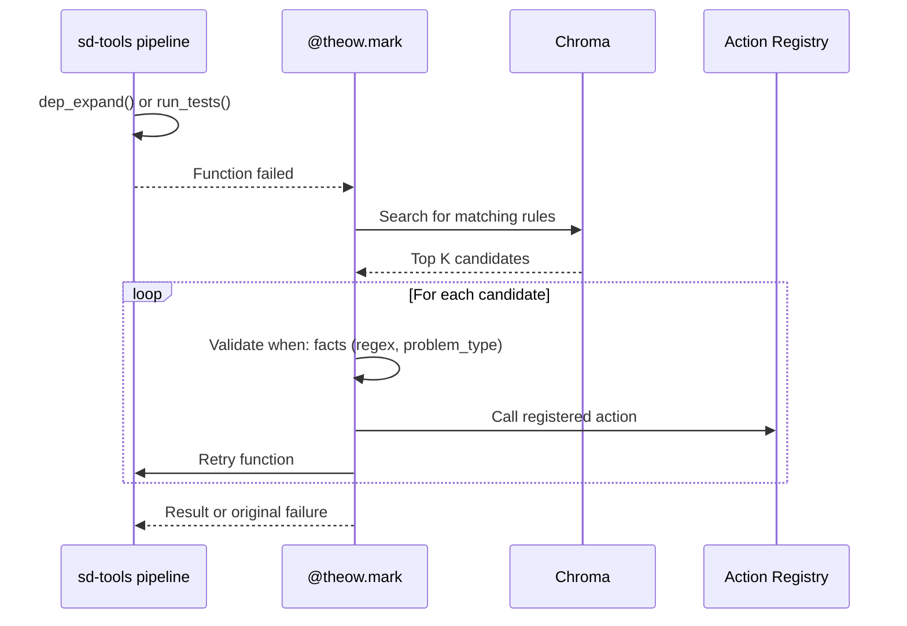
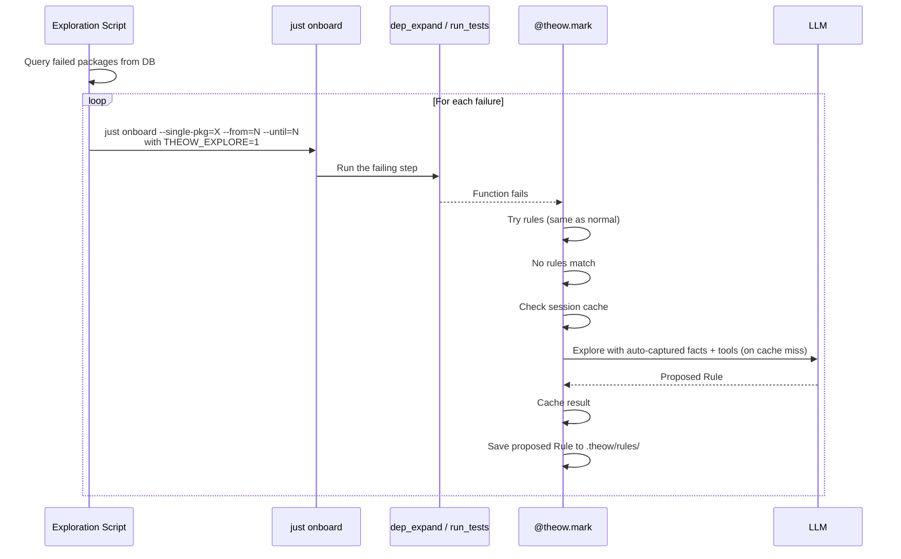
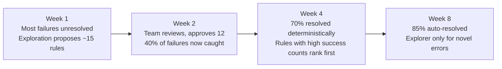

# Theow × sd-tools — Integration Design

> How sd-tools integrates Theow for automated dep resolution and test fixing.

---

## 1. Context

sd-tools onboards ~20k Go packages into a custom store. Two steps break most often:

**Dep tree expansion** where `go mod tidy -e` fails silently (module renames, vanished repos, version conflicts). Packages get incorrectly marked as leaf nodes. Currently fixed with hardcoded heuristics in sd-tools code.

**Test execution** (step 9) where `sourcecraft test` fails. Only two hardcoded fixes exist today (Go version mismatch, go vet failure). Missing tests, broken tests, everything else requires manual human work.

Theow replaces the hardcoded heuristics with an extensible, learning rule engine.

---

## 2. Boundary

| | sd-tools | Theow |
|---|---|---|
| **Owns** | Rules, tool/action implementations, prompts, invocation, git, DB, PRs, human-in-the-loop, exploration targets | Matching engine, Chroma, LLM gateway, learning loop |
| **Does** | Acts on rules, writes files, commits, pushes, opens PRs, decides what to explore and when | Returns matched rules, proposes new rules as artifacts |

**Theow never touches:** sd-tools DB, packages, repos, git, PRs.

---

## 3. Resolution Mode



### Setup

```python
from theow import Theow

theow = Theow(
    theow_dir="./.theow",
    llm="gemini/gemini-2.0-flash",
    llm_secondary="anthropic/claude-sonnet-4-20250514",
)
```

### Dep Tree Expansion

```python
@theow.action("fix_go_mod_replace")
def fix_go_mod_replace(old_path, new_path, workspace):
    subprocess.run(["go", "mod", "edit", "-replace",
                    f"{old_path}={new_path}@latest"], cwd=workspace)
    subprocess.run(["go", "mod", "tidy", "-e"], cwd=workspace)

@theow.action("pin_dependency")
def pin_dependency(module, version, workspace):
    subprocess.run(["go", "get", f"{module}@{version}"], cwd=workspace)

@theow.mark(
    problem_type="dep_expansion",
    facts_from=lambda tree, ob: {
        "package": tree.package,
        "go_mod": read_go_mod(tree),
        "stderr": ob.last_stderr,
    },
    max_retries=5,
    tags=["go", "dep_expansion"],
    fallback=True,
)
def dep_expand(tree, ob):
    return ob.run(tree, "go mod tidy -e", timeout=300)
```

### Test Execution

```python
@theow.tool()
def create_sandbox(pkg: str) -> str:
    """Clone package to tmp dir, return workspace path."""
    workspace = f"/tmp/theow_{pkg.replace('/', '_')}"
    subprocess.run(["git", "clone", mirror_url(pkg), workspace])
    return workspace

@theow.tool()
def read_file(path: str) -> str:
    """Read a file from the workspace."""
    return Path(path).read_text()

@theow.tool()
def write_file(path: str, content: str) -> dict:
    """Write content to a file in the workspace."""
    Path(path).write_text(content)
    return {"status": "ok", "path": path}

@theow.tool()
def run_sourcecraft_test(workspace: str) -> dict:
    """Run sourcecraft test in the correct sandbox environment."""
    result = subprocess.run(
        ["sourcecraft", "test"],
        cwd=workspace, capture_output=True, timeout=900
    )
    return {
        "returncode": result.returncode,
        "stdout": result.stdout.decode(),
        "stderr": result.stderr.decode(),
    }

@theow.mark(
    problem_type="test_failure",
    facts_from=lambda tree, ob: {
        "package": tree.package,
        "source_files": list_go_files(tree),
        "go_version": get_go_version(tree),
    },
    max_retries=3,
    tags=["go", "test"],
    explorable=True,
)
def run_tests(tree, ob):
    return ob.run(tree, "sourcecraft test", timeout=900)
```

---

## 4. Rules

Rules live in sd-tools' repo under `.theow/rules/`. sd-tools team writes, reviews, and maintains them.

### Migrated Heuristics

The two existing hardcoded fixes become rules:

```yaml
# .theow/rules/go_version_mismatch.rule.yaml
name: go_version_mismatch
description: >
  Test fails because module requires an older Go version
  than installed. Patch spread task.yaml to install correct version.
tags: [go, test, version, manual]

when:
  - fact: problem_type
    equals: test_failure
  - fact: stderr
    contains: "go: go.mod requires go >="
    examples:
      - "go: go.mod requires go >= 1.21 (running go 1.25)"
      - "go: go.mod requires go >= 1.18.0 (running go 1.25)"

then:
  - action: patch_spread_go_version
    params:
      go_version: "{extract.1}"
```

```yaml
# .theow/rules/go_vet_failure.rule.yaml
name: go_vet_failure
description: >
  go vet fails, blocking test execution. Add -vet=off flag.
tags: [go, test, vet, manual]

when:
  - fact: problem_type
    equals: test_failure
  - fact: stderr
    contains: "go vet"
    examples:
      - "# pkg\nvet: exiting due to errors"
      - "go: go vet failed"

then:
  - action: patch_spread_vet_off
```

### Dep Tree Rules

```yaml
# .theow/rules/module_path_rename.rule.yaml
name: module_path_rename
description: >
  Module had a URL rename. go mod tidy fails because the
  required path doesn't match the declared path. Poisons
  entire module graph.
tags: [go, dep_expansion, rename, manual]

when:
  - fact: problem_type
    equals: dep_expansion
  - fact: stderr
    regex: 'module declares its path as: (\S+)\s+but was required as: (\S+)'
    examples:
      - |
        github.com/imdario/mergo@v1.0.2: parsing go.mod:
              module declares its path as: dario.cat/mergo
              but was required as: github.com/imdario/mergo
      - |
        github.com/golang/lint@v0.0.0: parsing go.mod:
              module declares its path as: golang.org/x/lint
              but was required as: github.com/golang/lint

then:
  - action: fix_go_mod_replace
    params:
      new_path: "{extract.1}"
      old_path: "{extract.2}"
```

```yaml
# .theow/rules/false_leaf_detection.rule.yaml
name: false_leaf_detection
description: >
  Package marked as leaf with 0 deps but go.mod has require
  directives. Dep expansion failed silently.
tags: [go, dep_expansion, silent_failure, manual]

when:
  - fact: problem_type
    equals: dep_expansion
  - fact: leaf_status
    condition: "marked_leaf AND go_mod_has_requires"

then:
  - action: rerun_dep_expansion
```

---

## 5. Exploration Mode

The `@theow.mark(explorable=True)` decorators are already on `dep_expand` and `run_tests`. Exploration is just running the normal pipeline with `THEOW_EXPLORE=1`.

### The Exploration Script

```python
failures = db.query("""
    SELECT name, failed_step
    FROM packages WHERE state = 'failed'
    ORDER BY rank ASC
""")

for pkg in failures:
    subprocess.run(
        ["just", "onboard", "go",
         f"--single-pkg={pkg.name}",
         f"--from={pkg.failed_step}",
         f"--until={pkg.failed_step}"],
        env={**os.environ, "THEOW_EXPLORE": "1"},
    )
```

That's it. No separate explore calls. No manual fact building. No reproduction logic. The decorator catches the failure, has the full exception and facts, runs the LLM with all registered tools, caches similar errors via the session cache, and respects `session_limit`.



### What Happens to Proposed Rules

The exploration run produces `.rule.yaml` files in `.theow/rules/` tagged `auto`. The team reviews them:

- Good rule? Keep it. Next pipeline run, the Resolver picks it up.
- Bad rule? Delete it. The explorer will try something different next time.
- Close but not right? Edit it. Humans can refine what the LLM proposed.

### Normal Pipeline Run vs Exploration Run

```bash
# Normal: resolve only, no LLM, safe
just onboard go

# Exploration: resolve first, LLM fallback for unmatched failures
THEOW_EXPLORE=1 just onboard go --single-pkg="github.com/some/pkg" --from=9 --until=9
```

Same code, same decorators, same pipeline. The env var is the only difference.

---

## 6. What Changes in sd-tools

### Changes

1. Add Theow dependency (`pip install theow`)
2. Create `.theow/` directory with rules and prompts
3. Register tools and actions
4. Decorate `dep_expand` and `run_tests` with `@theow.mark()`
5. Remove hardcoded `patch_failed_tests()`, replaced by rules
6. Write exploration script: loop over failures, run `just` with `THEOW_EXPLORE=1`

### Unchanged

- Pipeline structure (11 steps, same order)
- Database schema
- Git workflow
- Build/pack/publish steps
- PR and review processes
- Everything outside dep expansion and test execution

---

## 7. Cost Model

| Scenario | LLM calls | Approx cost |
|---|---|---|
| Deterministic rule matches | 0 | Free |
| Vector similarity finds past fix | 0 | Free |
| Novel error, LLM diagnoses | 1 call | $0.01 to $0.10 |
| Complex exploration with tool use | 1 session | $0.05 to $0.50 |

Distribution shifts left over time. More rules, fewer LLM calls.

---

## 8. The Learning Cycle



The cycle: run exploration in CI, Theow proposes rules, team skims and approves the good ones, drops the bad ones. Over time the rule set grows, resolve hit rate goes up, exploration calls go down.

---

## 9. Open Questions

- **Sandbox environment**: how does `sourcecraft test` sandbox work? Tool implementations need to match.
- **Parallel workers**: 12 workers. With `THEOW_EXPLORE=1`, LLM blocks for 10 to 30 seconds. Run exploration single-threaded or limit concurrency?
- **Failure reproduction**: does `just onboard go --single-pkg=... --from=N --until=N` work reliably for all failure types?
